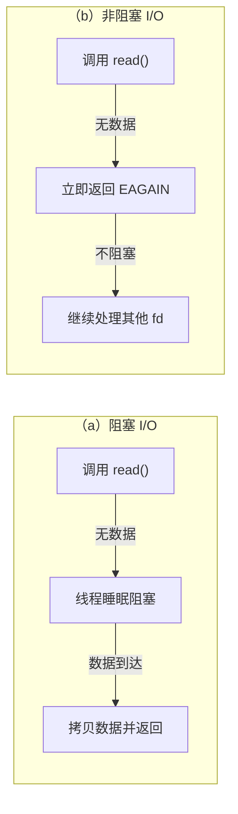
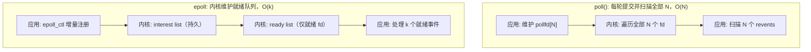
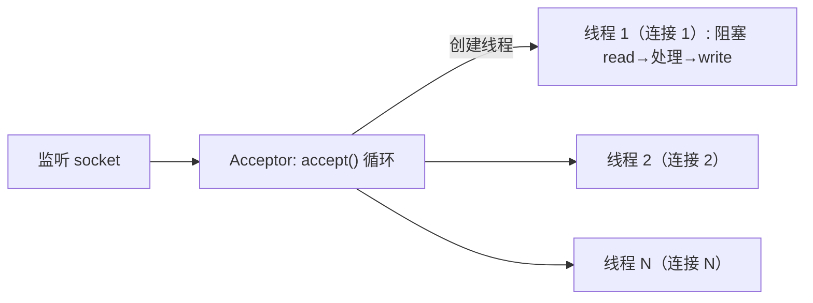
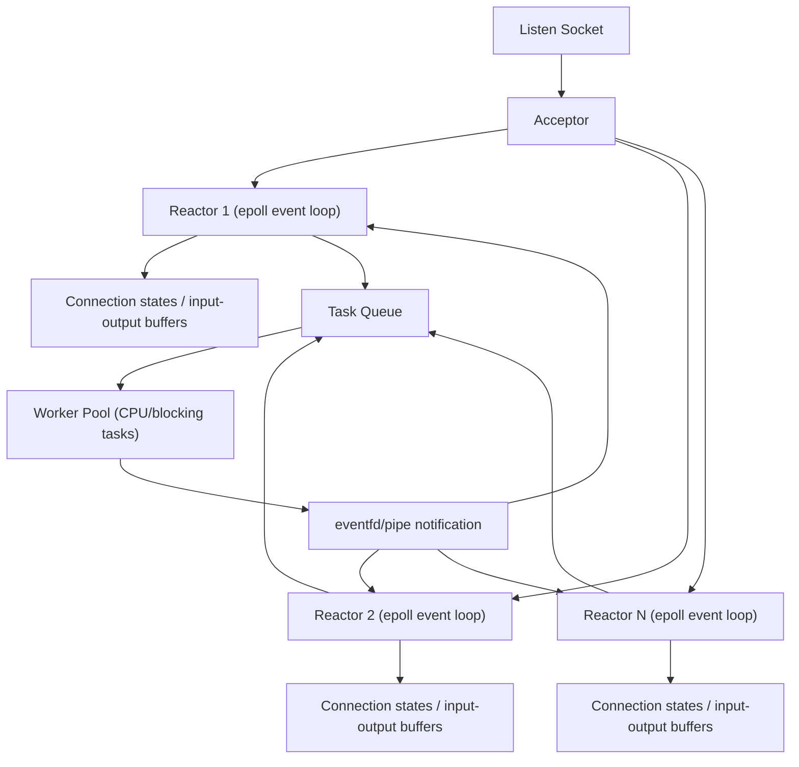

# 基于 poll、epoll 与多线程模型的高吞吐 Echo 服务器设计与实验分析

## 摘要

高并发网络服务器需要在有限 CPU、内存、文件描述符和调度资源下同时维护大量连接。围绕 Lab1 Part B 的 TCP echo server 场景，本文比较了基于 `poll()` 的 I/O 多路复用服务器、基于 `epoll` 的 Reactor 服务器，以及基于多线程阻塞 I/O 的服务器。论文首先从阻塞/非阻塞 I/O、就绪通知、完成通知和线程调度开销出发，分析不同模型的机制差异；随后结合 NGINX、Redis 和 libuv 的工程实践，归纳高吞吐服务器中事件循环、慢任务隔离和背压控制的设计原则；最后基于本仓库 `res/` 目录中的 5 组压测数据，对三种实现分别在纯 echo、阻塞型慢任务、CPU 型慢任务、客户端并发变化和高连接压力下的吞吐量、延迟和错误数进行比较。实验结果显示：纯 echo 场景中 `server_pool` 借助多核并行取得最高吞吐，`server_epoll` 在连接数升高时明显优于 `server_poll`；加入阻塞型或 CPU 型业务成本后，单线程 `poll`/`epoll` 被请求处理串行化，而多线程模型能显著吸收慢任务；但当连接数上探到 8000、16000 时，每连接线程模型吞吐快速下降并在 16000 连接出现错误，说明其扩展性受线程资源和调度开销约束。基于原理和实验，本文建议面向通用高吞吐服务器采用“多 Reactor + epoll + 工作线程池”的混合架构。

**关键词**：高并发服务器；I/O 多路复用；poll；epoll；多线程；Reactor；echo server

## 1. 引言

网络服务器的核心挑战不是一次处理一个连接，而是在连接数和请求速率持续增长时，仍然保持可接受的吞吐量、尾延迟和资源占用。Dan Kegel 在 C10K 问题中将“一万并发连接”抽象为操作系统接口、事件通知机制和服务器架构共同作用的问题，指出高并发并不能简单依靠增加线程数量解决 [7]。在 UNIX 网络编程语境中，服务器通常需要在阻塞 I/O、多进程/多线程、非阻塞 I/O、多路复用和异步 I/O 之间做取舍 [16][17]。

Lab1 Part B 要求实现并分析不同并发 I/O 模型。本文选择 TCP echo server 作为统一工作负载：客户端发送固定大小消息，服务器原样返回，客户端统计请求完成数、吞吐量和往返延迟。echo 协议的业务逻辑极短，因此能较集中地暴露 I/O 模型、事件分发和线程调度本身的开销。

除操作系统接口本身外，成熟开源系统也为本文提供了工程背景。NGINX 使用 master/worker 和事件驱动模型处理大量连接 [8][9][10]；Redis 以单主事件循环减少共享状态和锁竞争，并将慢任务移出主路径 [11][12][13]；libuv 将网络 I/O 交给平台最佳 poller，同时用线程池处理文件系统、DNS 和用户任务 [14][15]。这些系统共同说明，高吞吐服务器通常不是简单地增加线程数量，而是需要区分连接管理、事件通知、业务处理和慢任务隔离。

本文关注三个问题：

1. 从阻塞/非阻塞 I/O、I/O 多路复用、异步 I/O 到多线程 I/O，各类模型在等待、事件发现、完成通知和线程调度职责上如何演进？
2. 在本次 echo server 实验数据中，`poll()`、`epoll` 与多线程阻塞 I/O 三种实现面对不同连接规模、阻塞型慢任务、CPU 型慢任务和客户端并发度时，吞吐量、延迟和错误率呈现什么趋势？
3. 结合 NGINX、Redis 和 libuv 等开源系统经验，若设计一个更通用的高吞吐 I/O 服务器，应如何组合事件循环、非阻塞 I/O 和工作线程池？

## 2. I/O 模型原理分析

I/O 模型的演进可以从性能瓶颈出发理解：最初，应用直接调用阻塞或非阻塞系统调用，等待策略主要由应用线程自身承担；随后，`select()`、`poll()` 和 `epoll` 把“同时等待多个 fd”的职责逐步迁移到内核；再往后，POSIX AIO 与 io_uring 试图把“提交 I/O 请求”和“等待 I/O 完成”进一步解耦；在多核机器上，单个事件循环又会遇到 CPU 利用率上限，于是出现了多线程 I/O 和“事件循环 + 工作线程池”的混合结构。换言之，高性能 I/O 的演进主线不是单个 API 的替换，而是围绕等待、发现、调度和完成通知这些职责不断重新分配。

### 2.1 系统原生阻塞与非阻塞 I/O

最直接的 I/O 方式是阻塞 I/O。线程在阻塞 socket 上调用 `accept()`、`read()` 或 `write()` 时，如果连接尚未到来、数据尚未到达或发送缓冲区暂时不可写，当前线程会进入睡眠，直到条件满足、连接关闭、发生错误或被信号打断。阻塞 I/O 的优点是控制流简单：一次系统调用看起来就像一次普通函数调用，应用代码可以按“接收连接、读取请求、处理请求、写回响应”的顺序书写。

阻塞 I/O 的性能瓶颈也很明显：等待被绑定在当前线程上。如果一个线程只服务一个连接，连接空闲时线程大部分时间都在睡眠，线程栈、调度状态和上下文切换却仍然存在；如果一个线程试图顺序服务多个阻塞 fd，那么它可能被其中一个暂时无数据的 fd 卡住，导致其他已经就绪的连接得不到处理。因此，原生阻塞 I/O 把“等待某个 fd 就绪”的职责交给内核，但没有解决“一个执行流如何同时管理多个 fd”的问题。

非阻塞 I/O 是第一步优化。应用通过 `fcntl()` 等方式将 fd 设置为非阻塞后，`read()`、`write()` 或 `accept()` 在暂时不能完成时不会让线程睡眠，而是立即返回 `-1`，并设置 `errno` 为 `EAGAIN` 或 `EWOULDBLOCK`。这样，应用线程不会被单个连接长期挂住，可以继续检查其他连接。

但是，非阻塞 I/O 只是把阻塞等待变成了快速失败，并没有自动提供高性能调度。如果应用简单地在用户态循环遍历所有 fd 并反复调用 `read()`，就会形成忙等：大量系统调用只得到 `EAGAIN`，CPU 时间消耗在无效探测上。此时瓶颈从“线程睡眠导致其他连接无法推进”转变为“应用不知道哪些 fd 真正值得尝试 I/O”。因此，下一阶段优化的核心是：由内核帮助应用同时等待多个 fd，并只在 fd 可能就绪时唤醒应用。

<b>图 2-1</b>　阻塞与非阻塞 <code>read()</code> 在“数据未就绪”时的执行流对比

### 2.2 基于非阻塞 I/O 的优化：select、poll 与 epoll 设计迭代

`select()` 是早期 I/O 多路复用接口。应用将关注的 fd 放入 `fd_set` 位图，并把读、写、异常事件集合传给内核；内核在一个系统调用内同时等待这些 fd 的就绪状态，并在返回时改写位图，标出哪些 fd 已经就绪 [1]。相较用户态反复轮询，`select()` 的关键进步是把“等待多个 fd 中任意一个就绪”的职责交给内核，应用不再需要对每个 fd 做无意义的非阻塞读写试探。

`select()` 的瓶颈来自它的位图表示和无状态调用方式。第一，`fd_set` 通常受 `FD_SETSIZE` 限制，可表达的 fd 数量有限 [1]。第二，每次调用前应用都要重新构造关注集合，因为返回时集合会被改写为就绪集合。第三，内核需要检查传入范围内的 fd，应用返回后也要再次扫描位图才能知道具体哪些 fd 就绪。因此，当 fd 编号范围较大或连接很多但活跃连接很少时，`select()` 会把大量时间花在线性扫描和用户态/内核态数据复制上。

`poll()` 对 `select()` 的表示方式做了改进。它使用 `struct pollfd` 数组表示关注对象，每个元素包含 fd、关注事件 `events` 和返回事件 `revents` [2]。这解决了 `select()` 固定位图大小和 fd 编号稀疏时空洞扫描的问题：应用只需要把实际关注的 fd 放进数组，接口也更直观。

但是，`poll()` 没有改变“每轮调用都重新提交完整关注集合”的本质。假设共有 N 个连接，其中当前只有 k 个连接就绪，应用仍要把 N 个 `pollfd` 项传给内核，内核仍要检查 N 个项，返回后应用也要扫描 N 个 `revents` 字段。也就是说，`poll()` 把 fd 集合表示从位图优化为数组，却仍然是无状态的 O(N) 事件发现模型。当 N 很大、k 很小时，主要成本依旧来自无效扫描。

`epoll` 的设计迭代更进一步：它把关注集合长期保存在内核中。应用先通过 `epoll_create1()` 创建 epoll 实例，再用 `epoll_ctl()` 对 fd 做 ADD、MOD 或 DEL；事件到达时，内核将对应 fd 加入 ready list；应用调用 `epoll_wait()` 时，内核只返回当前已经就绪的事件 [3]。这意味着 `epoll` 不再要求应用每轮传入完整 fd 集合，也不要求应用每轮扫描所有连接。其关键职责迁移是：关注集合维护、就绪状态跟踪和就绪队列管理从用户态循环迁入内核。

从调度策略看，`epoll` 还提供水平触发和边缘触发两种语义。水平触发是默认模式：只要 fd 仍处于可读或可写状态，后续 `epoll_wait()` 仍可能继续返回该事件，编程更稳妥。边缘触发只在状态变化时通知，例如从不可读变为可读；它减少重复通知，但要求 fd 使用非阻塞模式，并在收到事件后循环读写直到 `EAGAIN`，否则可能遗漏缓冲区中未处理的数据 [3]。本实验的 `server_epoll` 使用 LT 模式，选择的是更安全、更易验证的调度策略。

三者的设计迭代可以概括如下：

| 接口 | 主要改进 | 仍然存在的瓶颈 | 职责迁移程度 |
|---|---|---|---|
| `select()` | 内核统一等待多个 fd 就绪 | fd 集合大小限制、位图重建、内核和用户态重复扫描 | 内核负责等待，应用仍负责重建集合和扫描结果 |
| `poll()` | 用数组表示 fd，消除固定 `FD_SETSIZE` 限制 | 每轮仍传入完整数组，事件发现仍是 O(N) | 内核负责等待，应用仍承担完整集合提交与线性扫描 |
| `epoll` | 内核保存 interest list，并维护 ready list | Linux 特有；ET 模式编程复杂 | 内核负责关注集合维护和就绪队列调度，应用处理就绪项 |

因此，`select()`、`poll()` 和 `epoll` 的差异不只是接口形式不同，而是 I/O 职责不断向内核迁移的结果：从“应用反复试探 fd”，到“内核等待一批 fd”，再到“内核长期维护关注集合并只交付就绪事件”。这正是 `epoll` 在大量长连接场景中通常优于 `poll()` 的根本原因。

<b>图 2-2</b>　<code>poll()</code> 与 <code>epoll</code> 的 fd 集合处理方式对比（N 为总连接数，k 为就绪数）

### 2.3 异步 I/O：POSIX AIO 与 io_uring

`select()`、`poll()` 和 `epoll` 都属于就绪通知模型。它们告诉应用“某个 fd 现在可能可以读或写”，但真正的数据拷贝和请求完成仍需要应用随后调用 `read()`、`write()` 或 `send()`。这意味着应用仍然要组织状态机、处理短读短写、处理 `EAGAIN`，并把一次业务请求拆成多次就绪事件推进。

异步 I/O 试图进一步改变职责边界：应用不再只等待“fd 可读/可写”，而是提交一个 I/O 请求，然后等待“这次请求已经完成”。POSIX AIO 提供 `aio_read()`、`aio_write()`、`aio_error()` 和 `aio_return()` 等接口，应用可以提交异步读写请求，并通过信号、线程通知或轮询方式获得完成结果 [4][5]。从模型上看，它把“等待 I/O 完成”的职责从应用线程中抽离出来，应用可以在请求未完成时继续执行其他任务。

POSIX AIO 的局限在于 Linux 上的实际使用场景和性能表现较复杂。它虽然提供了标准化接口，但在网络 I/O、高性能服务器和不同文件类型上的适用性并不总是理想；在许多工程实践中，事件驱动网络 I/O 仍主要依赖 `epoll`，而不是 POSIX AIO。也就是说，POSIX AIO 在抽象上完成了从就绪通知到完成通知的迁移，但工程上没有成为 Linux 网络服务器的主流高性能路径。

io_uring 是 Linux 上更新的异步 I/O 接口。它的核心是提交队列 SQ 和完成队列 CQ：应用把操作描述为 SQE 放入提交队列，内核执行后把结果以 CQE 形式放入完成队列 [6]。这套结构可以映射到用户态，支持批量提交、批量收割完成事件，并在某些配置下减少系统调用次数。与 `epoll` 相比，io_uring 不只是告诉应用 fd 已就绪，而是让应用提交具体操作，并从完成队列中读取操作结果。

从性能瓶颈角度看，io_uring 主要针对系统调用频繁、请求粒度小、需要批处理的场景。传统模型中，每次 accept、read、write、wait 都可能对应独立系统调用；io_uring 则试图把多个操作合并提交，并把完成事件集中回收，从而降低用户态和内核态切换成本。它体现了更彻底的职责迁移：应用负责准备请求和消费完成结果，内核负责排队、执行和完成通知。不过，io_uring 的代价是接口复杂、内核版本相关、调试难度更高。对本实验而言，io_uring 更适合作为高阶扩展，而 `poll()`、`epoll` 和多线程 I/O 已足以完成基础对比。

<b>图 2-3</b>　<code>io_uring</code> 的提交队列 SQ 与完成队列 CQ：从就绪通知转向完成通知

### 2.4 多核情况下的多线程 I/O

上述模型主要优化“一个执行流如何高效管理多个 I/O 对象”。但现代服务器通常是多核机器，单个事件循环即使使用 `epoll`，也只能主要消耗一个 CPU 核。当请求处理包含协议解析、拷贝、压缩、加密、日志、数据库访问或磁盘 I/O 时，单线程 Reactor 可能成为 CPU 利用率瓶颈；一旦某个处理步骤阻塞，整个事件循环上的连接都会受到影响。因此，在多核环境下，还需要引入多线程 I/O 或多 Reactor 架构。

最直接的多线程方式是一个连接一个线程。每个连接使用阻塞 I/O，线程独立执行读、处理、写的循环。这种模型能够利用多核，代码也接近同步逻辑；在连接数不太高、请求很短、共享状态较少时，性能可能很好。本实验中的 `server_pool` 在中低连接数的 64 B echo 小消息负载下取得最高吞吐，说明在这类条件中，多线程并行收益超过了线程调度成本。

<b>图 2-4</b>　每连接一线程的阻塞 I/O 模型（<code>server_pool</code>）：N 个连接对应 N 个线程

但是，一个连接一个线程并不是通用最优解。连接数继续升高后，线程栈内存、线程创建销毁、调度器开销、上下文切换和缓存失效都会增加；如果多个线程访问共享队列、统计变量、日志或业务数据结构，还会产生锁竞争。此时性能瓶颈从“I/O 等待”转向“线程调度与共享状态同步”。这也是为什么高性能服务器通常不会简单地为每个连接长期保留一个线程。

更常见的工程折中是线程池或多 Reactor。线程池用固定数量 worker 处理任务，避免线程数量随连接数线性增长；多 Reactor 则把连接分散到多个事件循环，每个 Reactor 管理一部分非阻塞 socket，从而同时利用多个 CPU 核。对于可能阻塞或耗时的任务，可以交给 worker pool，完成后再通知对应 Reactor 写回结果。这种架构把 I/O 事件调度、连接状态管理和 CPU/阻塞任务执行分层处理，既保留 `epoll` 对大量连接的高效管理，又能利用多核处理业务逻辑。

因此，多线程 I/O 并不是对 `epoll` 的简单替代，而是多核条件下对单线程事件循环的补充。模型选择取决于瓶颈位置：如果瓶颈是大量空闲连接的就绪发现，`epoll` 更合适；如果瓶颈是 CPU 处理或阻塞任务，工作线程池更重要；如果连接数适中且业务逻辑极短，多线程阻塞 I/O 也可能在实验中取得很高吞吐。真正通用的高吞吐服务器通常需要把这些机制组合起来，而不是只依赖某一个 API。

## 3. 实验方法

### 3.1 实验对象

本实验比较三种服务器实现：

| 服务器 | 实现模型 | 主要机制 |
|---|---|---|
| `server_poll` | 单线程 I/O 多路复用 | 使用 `poll()` 管理监听 socket 和连接 socket |
| `server_epoll` | 单线程 Reactor | 使用 `epoll` LT 模式管理就绪事件 |
| `server_pool` | 多线程阻塞 I/O（每连接一线程） | 接收连接后由独立线程处理连接上的阻塞读写 |

三种服务器均实现 TCP echo 协议。为了让实验不仅停留在“纯 echo”场景，服务端额外提供了两类可控业务成本：`sleep_us` 表示每个请求执行一次 `usleep()`，模拟会阻塞执行流的慢 I/O 或等待；`work` 表示每个请求执行固定单位的整数忙计算，模拟 CPU 密集型处理。这样可以把 I/O 模型对“连接持有”“阻塞任务”和“CPU 计算”的响应拆开观察。

### 3.2 实验环境

实验运行在一台 KVM 虚拟化 Linux 服务器上，关键配置如下：

| 项目 | 配置 |
|---|---|
| 操作系统 | Ubuntu 22.04 LTS |
| 内核 | Linux 5.15.0-126-generic x86_64 |
| CPU | 4 vCPU，Intel Xeon Platinum 8255C @ 2.50 GHz |
| 内存 | 3.3 GiB，无 swap |
| 打开文件数上限 | `ulimit -n = 1048576` |
| listen backlog 上限 | `net.core.somaxconn = 4096` |
| 本地端口范围 | `32768-60999` |
| 编译工具 | GCC 11.2.0，GNU Make 4.3 |

该环境提供 4 个可并行执行的 CPU 上下文，因此 `server_pool` 有机会利用多核；而 `server_poll` 和 `server_epoll` 都是单线程事件循环，主要受单个执行流的处理能力限制。文件描述符上限明显高于实验连接数，因此 1000 至 16000 连接的压力测试更主要反映事件发现、连接管理、线程数量和调度开销，而不是简单的 fd 上限。

### 3.3 压测方法与数据来源

实验数据位于 `lab1/partB/res/`。其中 `results_exp*.csv` 为每次运行的原始 CSV，`exp1` 至 `exp5` 为对重复运行取均值后的汇总结果。除特别说明外，单条消息大小均为 64 B，每个参数组合重复 3 次，表中吞吐量和平均延迟为 3 次运行均值，错误数为 3 次运行求和。

客户端采用闭环负载模型：每个客户端线程同一时刻最多只有一个未完成请求，发送一条消息并收到完整回显后才发送下一条。因此，`threads` 更接近“同时在飞请求数”，而 `conns` 表示同时打开的连接数。二者含义不同：增加 `threads` 会增加服务端同一时刻需要推进的请求数；增加 `conns` 则更多考验连接持有成本，例如 `poll()` 的 O(N) 扫描和 `server_pool` 的每连接线程开销。

### 3.4 实验设计

本文使用五组实验覆盖不同负载维度：

| 实验 | 原始数据 | 主要变量 | 目的 |
|---|---|---|---|
| 实验 1：纯 echo 基线 | `results_exp1_baseline.csv` | `conns=100,500,1000,2000`，`threads=8` | 比较无业务成本时的连接数可扩展性 |
| 实验 2：阻塞型慢任务 | `results_exp2_blocking.csv` | `sleep_us=0,200,500,1000`，`conns=64`，`threads=8` | 观察阻塞等待对单线程 Reactor 和多线程模型的不同影响 |
| 实验 3：CPU 型慢任务 | `results_exp3_cpu.csv` | `work=0,100,300,500`，`conns=64`，`threads=8` | 观察 CPU 密集处理下单核事件循环与多核线程模型的差异 |
| 实验 4：客户端并发度扫描 | `results_exp4_concurrency.csv` | `threads=1,2,4,8,16,32`，`sleep_us=500` | 分析在飞请求数变化时吞吐与排队延迟的变化 |
| 实验 5：高连接压力 | `results_exp5_thread_pressure.csv` | `conns=1000,2000,4000,8000,16000`，`threads=8` | 观察大量连接持有下 `poll`、`epoll` 与每连接线程模型的拐点 |

实验 1 和实验 5 使用固定请求数，每次运行约 20 万请求；实验 2 至实验 4 因慢任务吞吐较低，使用 10 秒持续压测，避免单个参数组合耗时过长。记录指标包括成功请求数、错误数、耗时、吞吐量、带宽、平均延迟和 P50/P95/P99 延迟。

## 4. 实验结果

### 4.1 实验 1：纯 echo 基线

纯 echo 基线中，业务处理成本为 0，客户端线程数固定为 8，只改变同时打开的连接数。

| 服务器 | 连接数 | 平均吞吐 req/s | 平均延迟 ms | P99 ms | 错误数 |
|---|---:|---:|---:|---:|---:|
| `server_poll` | 100 | 75721 | 0.105 | 0.195 | 0 |
| `server_poll` | 500 | 47583 | 0.165 | 0.219 | 0 |
| `server_poll` | 1000 | 32296 | 0.243 | 0.298 | 0 |
| `server_poll` | 2000 | 30461 | 0.246 | 0.328 | 2931 |
| `server_epoll` | 100 | 84414 | 0.094 | 0.116 | 0 |
| `server_epoll` | 500 | 78802 | 0.099 | 0.122 | 0 |
| `server_epoll` | 1000 | 76438 | 0.101 | 0.124 | 0 |
| `server_epoll` | 2000 | 74611 | 0.102 | 0.128 | 0 |
| `server_pool` | 100 | 129328 | 0.062 | 0.214 | 0 |
| `server_pool` | 500 | 128196 | 0.059 | 0.189 | 0 |
| `server_pool` | 1000 | 124383 | 0.059 | 0.177 | 0 |
| `server_pool` | 2000 | 116303 | 0.063 | 0.195 | 0 |

结果显示，`server_pool` 在 100 至 2000 连接范围内吞吐最高，2000 连接时仍有 116303 req/s。这说明在 4 vCPU、短 echo 请求、8 个在飞请求的条件下，每连接线程模型的多核并行收益大于线程调度成本。`server_epoll` 吞吐低于 `server_pool`，但随连接数增长衰减很小，从 100 连接到 2000 连接仅下降约 11.6%，平均延迟也稳定在 0.094 ms 至 0.102 ms。相比之下，`server_poll` 从 75721 req/s 降至 30461 req/s，下降约 59.8%，并在 2000 连接累计 2931 个错误，说明线性扫描和连接管理压力已经影响稳定性。

该组实验验证了 `epoll` 相对 `poll()` 的基本优势：当连接数增加而活跃请求数固定时，`poll()` 仍需要反复扫描完整 `pollfd` 数组；`epoll` 则主要返回就绪事件，因此吞吐和尾延迟更平稳。但它也说明，纯 echo 小请求下最高吞吐不一定来自单线程 `epoll`，因为 `server_pool` 可以使用多个 CPU 核并行处理多个闭环请求。

### 4.2 实验 2：阻塞型慢任务

阻塞型慢任务固定连接数为 64、客户端线程数为 8，在每个请求中加入不同长度的 `usleep()`。

| 服务器 | `sleep_us` | 平均吞吐 req/s | 平均延迟 ms | P99 ms | 错误数 |
|---|---:|---:|---:|---:|---:|
| `server_poll` | 0 | 80165 | 0.099 | 0.186 | 0 |
| `server_poll` | 200 | 3544 | 2.256 | 3.993 | 0 |
| `server_poll` | 500 | 1713 | 4.667 | 8.227 | 0 |
| `server_poll` | 1000 | 921 | 8.684 | 15.275 | 0 |
| `server_epoll` | 0 | 84674 | 0.094 | 0.116 | 0 |
| `server_epoll` | 200 | 3565 | 2.243 | 2.315 | 0 |
| `server_epoll` | 500 | 1712 | 4.670 | 4.750 | 0 |
| `server_epoll` | 1000 | 921 | 8.682 | 8.780 | 0 |
| `server_pool` | 0 | 144804 | 0.056 | 0.186 | 0 |
| `server_pool` | 200 | 25150 | 0.317 | 0.388 | 0 |
| `server_pool` | 500 | 12901 | 0.619 | 0.692 | 0 |
| `server_pool` | 1000 | 7104 | 1.125 | 1.195 | 0 |

加入阻塞等待后，单线程 `server_poll` 和 `server_epoll` 的吞吐几乎完全被 `sleep_us` 串行化。以 `sleep_us=500` 为例，二者吞吐均约为 1710 req/s，平均延迟约为 4.67 ms。虽然每个请求只睡眠 0.5 ms，但闭环负载下有 8 个客户端线程同时等待；单线程事件循环一次只能处理一个请求，所以其他请求在队列中等待，平均延迟被放大到约 8 个请求的串行等待量级。

`server_pool` 的表现明显不同。`sleep_us=500` 时它仍有 12901 req/s，平均延迟约 0.619 ms，接近单次睡眠时间加少量调度开销。这是因为 `usleep()` 会让出 CPU，每连接线程可以并发睡眠，阻塞等待不会像单线程 Reactor 那样卡住所有连接。该结果说明，如果业务路径中存在不可避免的阻塞等待，必须将其从主事件循环隔离出去，否则 `poll` 与 `epoll` 的事件通知差异会被慢任务串行化掩盖。

### 4.3 实验 3：CPU 型慢任务

CPU 型慢任务固定连接数为 64、客户端线程数为 8，在每个请求中加入不同单位的忙计算。

| 服务器 | `work` | 平均吞吐 req/s | 平均延迟 ms | P99 ms | 错误数 |
|---|---:|---:|---:|---:|---:|
| `server_poll` | 0 | 79475 | 0.100 | 0.187 | 0 |
| `server_poll` | 100 | 5699 | 1.403 | 2.480 | 0 |
| `server_poll` | 300 | 1984 | 4.030 | 7.103 | 0 |
| `server_poll` | 500 | 1202 | 6.653 | 11.711 | 0 |
| `server_epoll` | 0 | 87033 | 0.091 | 0.116 | 0 |
| `server_epoll` | 100 | 5678 | 1.408 | 1.481 | 0 |
| `server_epoll` | 300 | 1987 | 4.024 | 4.151 | 0 |
| `server_epoll` | 500 | 1204 | 6.639 | 6.804 | 0 |
| `server_pool` | 0 | 143851 | 0.056 | 0.171 | 0 |
| `server_pool` | 100 | 17374 | 0.460 | 2.414 | 0 |
| `server_pool` | 300 | 6673 | 1.198 | 6.268 | 0 |
| `server_pool` | 500 | 4496 | 1.778 | 7.502 | 0 |

CPU 型慢任务下，`server_poll` 与 `server_epoll` 的吞吐几乎重合。例如 `work=500` 时二者分别为 1202 req/s 和 1204 req/s，说明瓶颈已经从事件发现转移到单线程 CPU 计算；此时 `epoll` 的 ready list 优势无法突破单个执行流的算力上限。

`server_pool` 在 CPU 负载下仍明显更高，`work=500` 时达到 4496 req/s，约为单线程实现的 3.7 倍。这与实验环境的 4 vCPU 基本吻合：CPU 计算不能像 `usleep()` 那样无限并发等待，最终受可用 CPU 核数约束。与此同时，`server_pool` 的尾延迟在 `work=300` 和 `work=500` 时分别达到 6.268 ms 和 7.502 ms，高于其平均延迟，说明多线程并行计算虽然提高吞吐，但也会引入调度、抢占和 CPU 竞争导致的尾部波动。

### 4.4 实验 4：客户端并发度扫描

该实验固定 `sleep_us=500`、连接数为 64，只改变客户端线程数。由于闭环客户端每个线程同时只有一个在飞请求，`threads` 可以近似看作同时到达服务端的请求并发度。

| 服务器 | `threads` | 平均吞吐 req/s | 平均延迟 ms | P99 ms | 错误数 |
|---|---:|---:|---:|---:|---:|
| `server_poll` | 1 | 1622 | 0.615 | 0.650 | 0 |
| `server_poll` | 2 | 1686 | 1.184 | 1.226 | 0 |
| `server_poll` | 4 | 1711 | 2.336 | 3.549 | 0 |
| `server_poll` | 8 | 1715 | 4.661 | 8.210 | 0 |
| `server_poll` | 16 | 1711 | 9.345 | 17.596 | 0 |
| `server_poll` | 32 | 1709 | 18.706 | 35.990 | 0 |
| `server_epoll` | 1 | 1636 | 0.609 | 0.637 | 0 |
| `server_epoll` | 2 | 1712 | 1.167 | 1.199 | 0 |
| `server_epoll` | 4 | 1711 | 2.335 | 2.387 | 0 |
| `server_epoll` | 8 | 1713 | 4.666 | 4.747 | 0 |
| `server_epoll` | 16 | 1710 | 9.347 | 9.484 | 0 |
| `server_epoll` | 32 | 1709 | 18.693 | 18.935 | 0 |
| `server_pool` | 1 | 1629 | 0.612 | 0.641 | 0 |
| `server_pool` | 2 | 3228 | 0.619 | 0.644 | 0 |
| `server_pool` | 4 | 6458 | 0.619 | 0.665 | 0 |
| `server_pool` | 8 | 12909 | 0.619 | 0.692 | 0 |
| `server_pool` | 16 | 25719 | 0.621 | 0.720 | 0 |
| `server_pool` | 32 | 50248 | 0.635 | 0.889 | 0 |

单线程 `server_poll` 和 `server_epoll` 的吞吐在 `threads>=4` 后基本固定在 1710 req/s 左右，但平均延迟随 `threads` 近似线性增长：`server_epoll` 从 1 线程时的 0.609 ms 上升到 32 线程时的 18.693 ms。这是典型的串行服务队列行为：服务速率由单线程中每次 500 us 的阻塞处理决定，客户端并发度增加后只能增加排队深度，而不能提高服务能力。

`server_pool` 则随 `threads` 增加近似线性扩展，从 1 线程的 1629 req/s 增至 32 线程的 50248 req/s，平均延迟始终约 0.62 ms。因为阻塞睡眠不消耗 CPU，更多连接线程可以同时进入睡眠并在醒来后返回响应。该组实验进一步说明，“连接数”和“在飞请求数”必须分开分析：在阻塞慢任务场景中，提高客户端并发度不能提升单线程 Reactor 的服务速率，却能显著提高多线程模型的重叠等待能力。

### 4.5 实验 5：高连接压力

高连接压力实验回到纯 echo 场景，客户端线程数固定为 8，但连接数从 1000 提高到 16000。由于在飞请求数仍为 8，大量连接处于空闲持有状态，主要考验连接管理成本。

| 服务器 | 连接数 | 平均吞吐 req/s | 平均延迟 ms | P99 ms | 错误数 |
|---|---:|---:|---:|---:|---:|
| `server_poll` | 1000 | 32117 | 0.246 | 0.310 | 0 |
| `server_poll` | 2000 | 31740 | 0.235 | 0.307 | 2931 |
| `server_poll` | 4000 | 29055 | 0.244 | 0.319 | 8931 |
| `server_poll` | 8000 | 22593 | 0.248 | 0.395 | 20931 |
| `server_poll` | 16000 | 15001 | 0.237 | 0.333 | 44931 |
| `server_epoll` | 1000 | 75469 | 0.102 | 0.124 | 0 |
| `server_epoll` | 2000 | 73806 | 0.104 | 0.125 | 0 |
| `server_epoll` | 4000 | 67192 | 0.099 | 0.197 | 0 |
| `server_epoll` | 8000 | 52451 | 0.066 | 0.137 | 11712 |
| `server_epoll` | 16000 | 24788 | 0.042 | 0.059 | 11385 |
| `server_pool` | 1000 | 121167 | 0.062 | 0.186 | 0 |
| `server_pool` | 2000 | 111175 | 0.065 | 0.190 | 0 |
| `server_pool` | 4000 | 71129 | 0.060 | 0.207 | 0 |
| `server_pool` | 8000 | 37431 | 0.058 | 0.217 | 0 |
| `server_pool` | 16000 | 15708 | 0.055 | 0.167 | 19989 |

该实验揭示了纯 echo 基线没有完全暴露的扩展性拐点。`server_pool` 在 1000 和 2000 连接时仍然领先，但随着连接数继续上升，吞吐从 121167 req/s 降至 16000 连接时的 15708 req/s，并在 16000 连接累计 19989 个错误。即使同时在飞请求只有 8 个，每连接线程模型仍要为大量空闲连接保留线程栈、调度状态和内核资源；连接数足够高后，线程资源和调度开销开始吞噬其多核并行优势。

`server_epoll` 在 1000 至 4000 连接范围内表现最稳定，4000 连接仍有 67192 req/s 且无错误；到 8000 和 16000 连接时也开始出现错误，说明本实验实现或运行环境仍存在高连接数边界，例如连接建立速率、端口资源、客户端/服务端关闭时序或缓冲区处理压力。但与 `server_poll` 相比，`server_epoll` 的吞吐下降更晚，错误出现也更晚，符合其连接持有成本较低的理论预期。

`server_poll` 在高连接压力下持续下降并最早出现错误。16000 连接时吞吐仅 15001 req/s，累计错误 44931 个。由于活跃请求数固定为 8，吞吐下降主要不能解释为业务并发增加，而应归因于 `poll()` 对大量 fd 的重复扫描、数组维护和连接关闭处理成本。

需要注意，表中高错误组的平均延迟不可直接解释为“服务变快”。例如 `server_epoll` 在 16000 连接时平均延迟为 0.042 ms，但同时出现 11385 个错误；这类延迟只统计成功请求，失败连接被排除后会形成幸存者偏差。因此，高压力场景应优先同时观察吞吐、错误数和成功请求延迟，不能只看平均延迟。

## 5. 讨论

### 5.1 负载类型决定瓶颈位置

五组实验共同说明，三种模型的优劣取决于瓶颈位置，而不是某个 API 永远占优。纯 echo 且连接数不太高时，`server_pool` 借助多核取得最高吞吐；连接数升高且大量连接空闲时，`server_epoll` 的 ready list 机制更能保持稳定；阻塞型慢任务出现时，单线程 `poll`/`epoll` 被请求处理串行化，而多线程模型可以重叠等待；CPU 型慢任务出现时，多线程模型仍占优，但优势上限接近 CPU 核数。

这也解释了实验 2 和实验 3 的差异。阻塞睡眠不占用 CPU，增加线程可以让多个请求同时等待；忙计算会真实占用 CPU，增加线程只能利用有限的 4 个 vCPU，超过核数后会出现抢占和尾延迟波动。因此，“慢任务”不能笼统分析，必须区分阻塞型慢任务和 CPU 型慢任务。

### 5.2 `epoll` 的价值在高连接持有场景更明显

实验 1 中，`server_epoll` 在 2000 连接时吞吐为 `server_poll` 的 2.45 倍，并且无错误；实验 5 中，`server_epoll` 到 4000 连接仍无错误，而 `server_poll` 从 2000 连接开始出现错误。该趋势与 `epoll` 的机制一致：当总连接数 N 远大于活跃请求数 k 时，`poll()` 每轮仍要扫描 N 个 fd，`epoll_wait()` 则主要交付就绪事件。

不过，`epoll` 不能自动解决慢业务问题。实验 2 和实验 3 中，一旦每个请求都要执行 `usleep()` 或忙计算，`server_epoll` 与 `server_poll` 的吞吐几乎相同，因为瓶颈已经不在事件发现，而在单线程请求处理本身。工程上因此需要把 `epoll` 与工作线程池结合，而不是把所有逻辑都放进事件循环。

### 5.3 每连接线程模型有明显适用边界

`server_pool` 在多数中低连接数实验中表现最好，说明每连接线程并非低效模型的同义词。在连接数适中、请求短、共享状态少、机器有多核时，它可以用简单同步代码换取很高吞吐；在阻塞型慢任务中，它还能够自然重叠等待。

但实验 5 表明，这种优势不能无限外推。连接数从 1000 提高到 16000 时，`server_pool` 吞吐下降约 87.0%，并在最高连接数出现 19989 个错误。每连接线程把连接持有成本直接映射为线程数量，连接空闲时线程也仍然占用栈空间、调度实体和内核资源。当目标是数千到数万长连接时，用少量 Reactor 线程管理大量非阻塞 socket 通常更可控。

### 5.4 实验局限

本实验已经从单一连接数扫描扩展到五个负载维度，并且每个参数组合重复 3 次，但仍有若干局限。首先，结果主要来自 loopback 和 KVM 虚拟机环境，跨机器网络、真实 NIC 中断和生产部署中的调度行为可能不同。其次，消息大小固定为 64 B，尚未覆盖大响应、慢客户端和持续写缓冲积压。第三，结果没有记录运行时 CPU 使用率、上下文切换次数、RSS 内存和 fd 占用，因而对线程调度开销和 `poll()` 扫描开销的解释主要来自现象与机制推断。第四，高连接数实验中出现错误后，成功请求延迟存在幸存者偏差，后续应结合错误类型、服务端日志和系统指标进一步定位。

后续可补充的实验包括：将消息大小扩展到 1 KiB、16 KiB；设置大量空闲连接和极少活跃连接，以更纯粹地突出 `poll()` 与 `epoll` 的连接持有成本差异；使用 `pidstat`、`perf stat` 或 `/proc` 记录 CPU 利用率、上下文切换和内存占用；对高错误组拆分连接失败、读写失败和超时失败类型；实现多 Reactor + worker pool 版本，并与现有三种服务器做直接对比。

## 6. 高吞吐服务器架构设计

### 6.1 开源框架调研成果

在提出服务器架构前，有必要先总结成熟开源框架的共同选择。NGINX、Redis 和 libuv 面向的业务场景不同，但它们都没有把高吞吐简单理解为“为每个连接创建一个线程”。相反，它们普遍将网络连接管理放在事件循环中，用非阻塞 I/O 和操作系统 poller 处理就绪事件，再把慢任务、阻塞任务或 CPU 密集任务隔离到后台路径。

NGINX 的代表性设计是 master/worker 模型。master 负责读取配置和管理 worker，worker 负责实际请求处理；在 Linux 上，worker 可以使用 `epoll` 作为连接处理机制 [8][10]。这种结构说明，高吞吐网络服务器需要先把连接处理做成轻量事件驱动状态机，再通过多 worker 利用多核，而不是让每个连接长期占用独立线程。NGINX 的设计还强调进程级隔离和资源上限控制，例如 worker 数量、连接数、文件描述符限制和输出缓冲都需要显式配置。

Redis 的设计重点不同。Redis 主要服务内存数据结构操作，单个命令通常很短，因此它倾向于使用单主事件循环串行处理客户端请求。客户端 socket 被设置为非阻塞，事件库封装底层 polling facility，并在数据到达时触发读写处理 [11][12]。该模型的优势是避免共享数据结构上的大量锁竞争，保持命令执行路径短而可预测；局限是慢命令、磁盘 I/O 或持久化操作可能阻塞主循环。因此 Redis 会将 AOF、RDB、部分慢 I/O 等任务放到后台线程或后台进程，以保护主事件循环的延迟 [13]。

libuv 则提供了更通用的跨平台事件循环抽象。它将网络 I/O 交给平台最佳 poller，例如 Linux 上的 `epoll`、BSD/macOS 上的 `kqueue`、Windows 上的 IOCP；同时提供全局线程池，用于文件系统操作、DNS 查询和用户提交的工作任务 [14][15]。libuv 的经验说明，一个工程化的 I/O 框架需要同时抽象“长生命周期 handle”和“一次性 request”，并让阻塞任务完成后回到 loop 线程执行收尾逻辑。

三者的调研结论可归纳为下表：

| 项目 | 核心 I/O 架构 | 解决的主要瓶颈 | 对本文设计的启发 |
|---|---|---|---|
| NGINX | 多 worker + 非阻塞事件驱动 | 大量连接、进程隔离、多核利用 | 多个事件循环分担连接；连接处理应轻量化、状态机化 |
| Redis | 单主事件循环 + 后台慢任务 | 共享数据结构锁竞争、低延迟命令执行 | 短任务留在事件循环；慢任务必须隔离 |
| libuv | 单 loop 抽象 + 全局线程池 | 跨平台 I/O 差异、文件/DNS 等阻塞操作 | 网络 I/O 与阻塞任务分层；完成结果回到 loop 线程 |

这些框架共同指向一个原则：主 I/O 路径应尽量短、非阻塞、可预测；后台执行路径负责吸收 CPU 密集或阻塞任务；二者之间通过队列、事件通知和缓冲区边界进行协调。结合前文 `poll()`、`epoll` 与多线程实验结果，本文推荐面向通用场景的高吞吐服务器采用“多 Reactor + epoll + 工作线程池”的混合架构。

### 6.2 推荐架构

该架构的核心原则如下：

1. 网络连接由固定数量 Reactor 线程持有，每个连接只归属一个 Reactor，避免多个线程同时读写同一个 socket。
2. 每个 Reactor 使用非阻塞 socket 和 `epoll_wait()` 处理 accept、read 和 write 事件，连接状态以状态机和输入/输出缓冲维护。
3. CPU 密集、磁盘 I/O、数据库访问、压缩、日志刷盘等慢任务交给工作线程池，避免阻塞 Reactor。
4. worker 完成任务后，通过 eventfd、pipe 或线程安全队列通知对应 Reactor，由 Reactor 统一写回响应。
5. 对每个连接设置输出缓冲上限，慢客户端触发背压，防止内存无限增长。
6. Reactor 数量通常与 CPU 核数或 NUMA 拓扑相关，worker 数量则根据慢任务类型和阻塞比例调优。

从对应关系看，多 Reactor 部分类似 NGINX 的多 worker 事件驱动模型，用多个事件循环分摊连接并利用多核 [8][9]；单个 Reactor 内部串行管理自己持有的连接，延续了 Redis 用事件循环减少共享状态和锁竞争的思想 [11][13]；工作线程池则接近 libuv 对文件系统、DNS 和用户任务的处理方式，将无法非阻塞化的工作移出主 I/O 路径，并在完成后回到事件循环收尾 [14][15]。

## 7. 结论

本文基于 Lab1 Part B 的调研材料和 `res/` 目录中的最新实验数据，对 `poll()`、`epoll` 和多线程阻塞 I/O 三种 echo server 实现进行了机制分析与实验比较。五组实验表明，模型优劣高度依赖负载类型：纯 echo 且连接数适中时，`server_pool` 依靠多核并行获得最高吞吐；大量空闲连接持有时，`server_epoll` 相比 `server_poll` 更稳定，体现了 ready list 机制相对线性扫描的优势；加入阻塞型慢任务后，单线程 `poll`/`epoll` 被请求处理串行化，而多线程模型能通过并发睡眠吸收等待；加入 CPU 型慢任务后，多线程模型仍有优势，但上限接近 CPU 核数并伴随尾延迟波动。

从更一般的服务器设计角度看，实验中的多线程优势不能简单推广为“每连接一线程最优”。高连接压力实验显示，当连接数上探到 8000 和 16000 时，每连接线程模型吞吐快速下降，并在 16000 连接出现错误；`poll()` 则更早受到线性扫描和连接管理压力影响。因此，真实高吞吐服务器需要同时考虑连接规模、活跃比例、业务计算量、阻塞任务、内存占用和尾延迟。更稳妥的方案是使用 `epoll` Reactor 管理大量非阻塞连接，并用固定大小工作线程池隔离 CPU 或阻塞任务，从而同时避免 `poll()` 的重复扫描和慢任务拖垮主 I/O 路径。

## 参考文献

[1] Michael Kerrisk. select(2) - Linux manual page. Linux man-pages. https://man7.org/linux/man-pages/man2/select.2.html

[2] Michael Kerrisk. poll(2) - Linux manual page. Linux man-pages. https://man7.org/linux/man-pages/man2/poll.2.html

[3] Michael Kerrisk. epoll(7) - Linux manual page. Linux man-pages. https://man7.org/linux/man-pages/man7/epoll.7.html

[4] IEEE/The Open Group. aio_read(3p) - POSIX Programmer's Manual. https://www.man7.org/linux/man-pages/man3/aio_read.3p.html

[5] Michael Kerrisk. aio(7) - Linux manual page. Linux man-pages. https://man7.org/linux/man-pages/man7/aio.7.html

[6] Jens Axboe. Efficient IO with io_uring. 2019. https://kernel.dk/io_uring.pdf

[7] Dan Kegel. The C10K problem. https://kegel.com/c10k.html

[8] NGINX Documentation. Control NGINX Processes at Runtime. https://docs.nginx.com/nginx/admin-guide/basic-functionality/runtime-control/

[9] NGINX Community Blog. Inside NGINX: How We Designed for Performance & Scale. https://blog.nginx.org/blog/inside-nginx-how-we-designed-for-performance-scale

[10] NGINX Documentation. Connection processing methods. https://nginx.org/en/docs/events.html

[11] Redis Documentation. Event library. https://redis.io/docs/latest/operate/oss_and_stack/reference/internals/internals-rediseventlib/

[12] Redis Documentation. Redis client handling. https://redis.io/docs/latest/develop/reference/clients/

[13] Redis Documentation. Diagnosing latency issues. https://redis.io/docs/latest/operate/oss_and_stack/management/optimization/latency/

[14] libuv Documentation. Design overview. https://docs.libuv.org/en/v1.x/design.html

[15] libuv Documentation. Thread pool work scheduling. https://docs.libuv.org/en/v1.x/threadpool.html

[16] W. Richard Stevens, Stephen A. Rago. Advanced Programming in the UNIX Environment. Addison-Wesley.

[17] W. Richard Stevens, Bill Fenner, Andrew M. Rudoff. UNIX Network Programming, Volume 1: The Sockets Networking API. Addison-Wesley.
