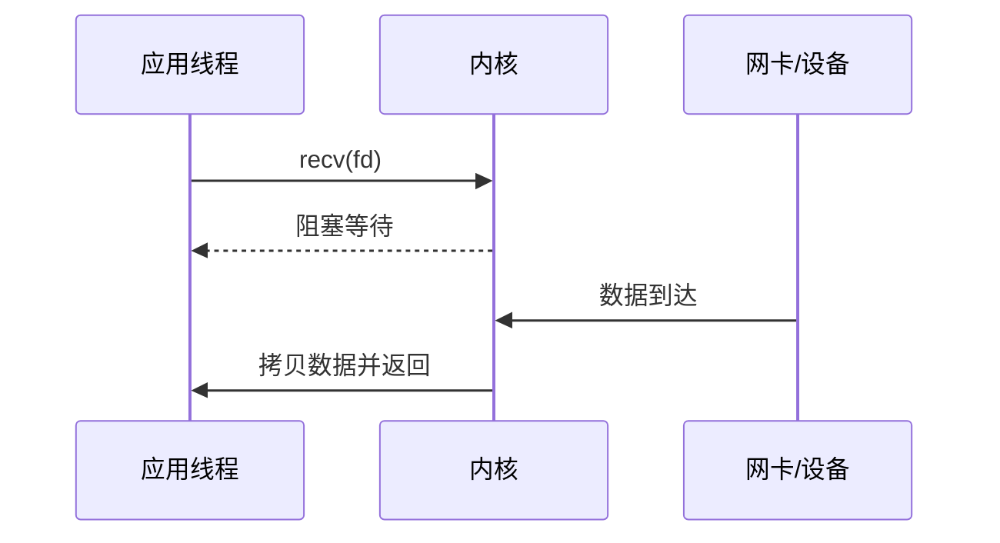
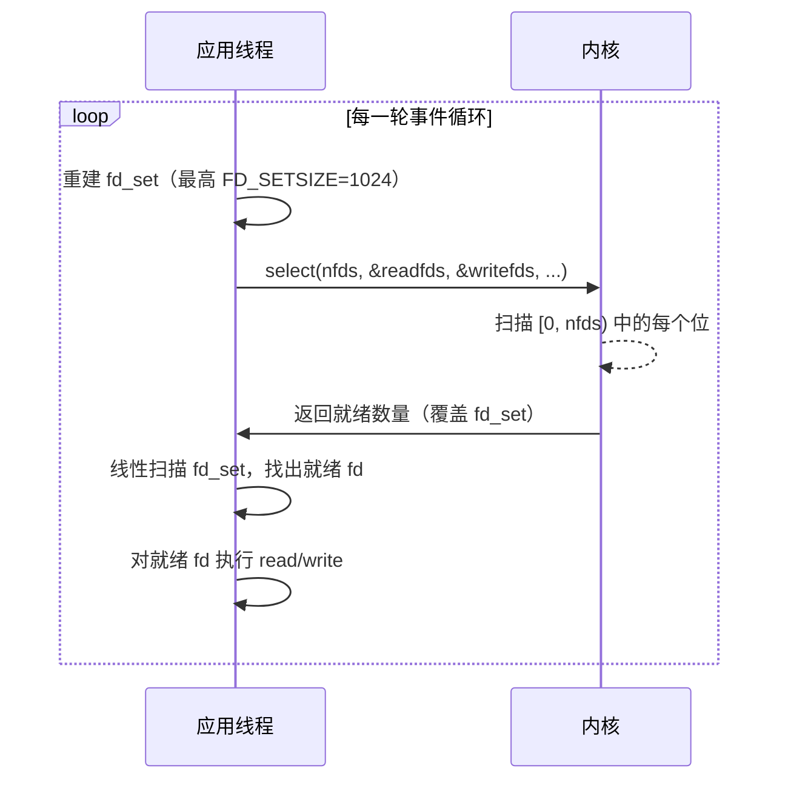
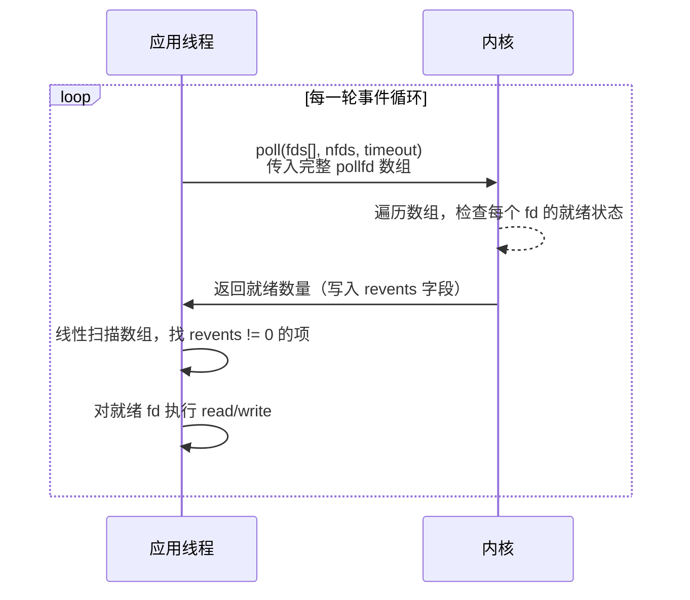
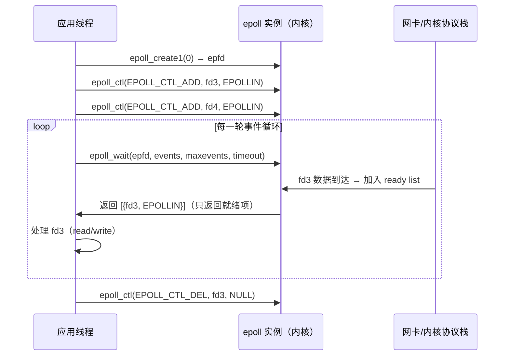
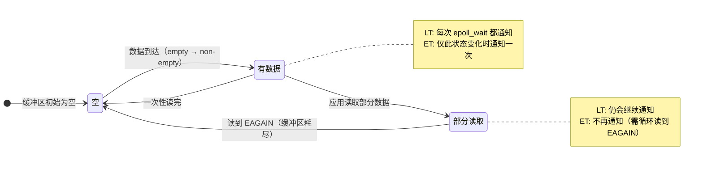
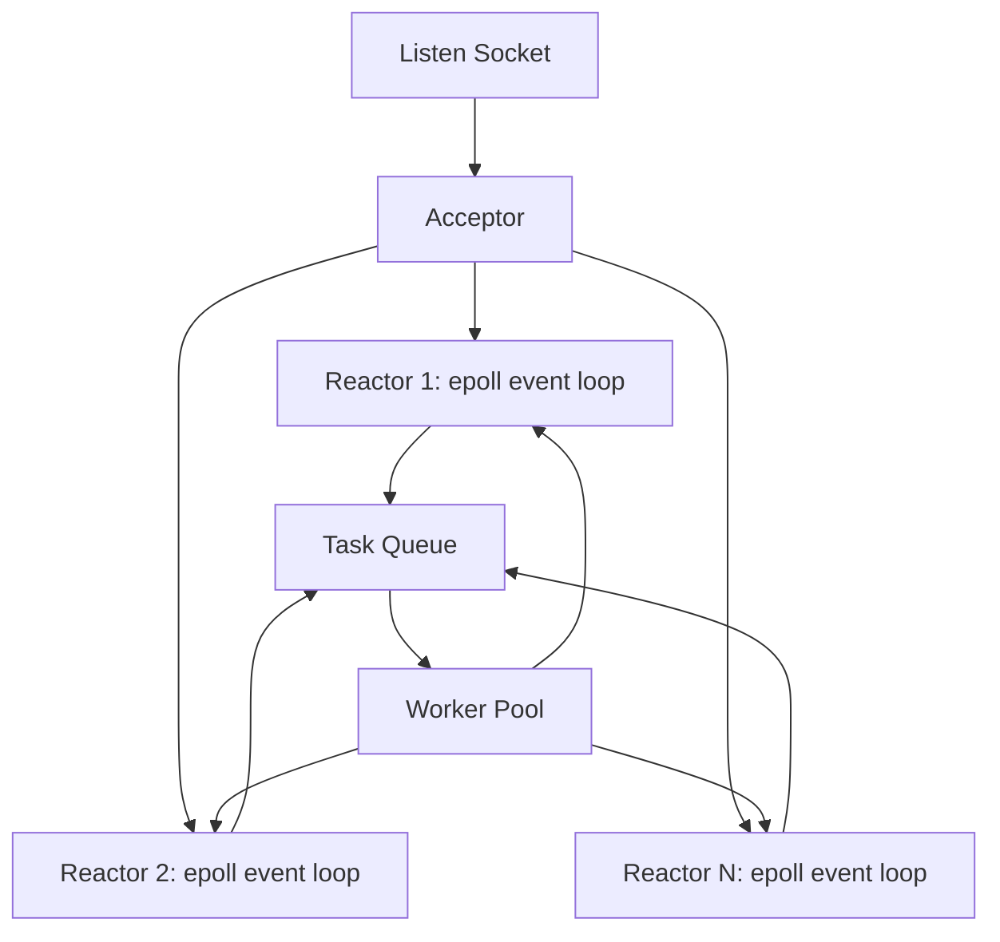

# Lab1 Part B 调研报告：高吞吐量 I/O 服务器设计与分析

访问日期：2026-05-18  
适用任务：Lab1 Part B（poll / 异步 I/O / 多线程 I/O 对比与高吞吐量 I/O 服务器设计）

## 摘要

Lab1 Part B 要求围绕并发 I/O 服务器展开原理分析、实验设计和架构论证。本文调研了 Linux 下阻塞 I/O、I/O 多路复用、POSIX AIO、io_uring 与多线程 I/O 的核心机制，并结合 NGINX、Redis、libuv 等工程实践，归纳高吞吐量服务器设计中的主要权衡：系统调用开销、文件描述符扫描成本、上下文切换、锁竞争、缓存局部性、背压控制和可维护性。

调研结论是：在 Lab1 的 TCP echo server 场景中，`poll()` 和线程池模型适合用作最低要求的对照实验；`epoll` 更适合大量长连接或大量空闲连接场景；`io_uring` 将提交队列和完成队列映射到用户态，适合进一步研究系统调用批处理、完成通知与统一异步接口，但实现复杂度明显更高。若目标是设计一个可解释、可实现、性能较稳的高吞吐量 I/O 服务器，推荐采用“多进程或多 Reactor + 每个 Reactor 使用 epoll + 小型工作线程池处理 CPU/阻塞任务”的混合架构。

## 1. 研究背景与问题定义

高并发服务器面对的核心问题不是“如何一次处理一个连接”，而是如何在有限 CPU、内存、文件描述符和网络带宽下，同时管理大量连接的生命周期。阻塞式 I/O 的逻辑最简单，但在一个线程服务一个连接时会引入大量线程、栈内存和上下文切换成本；事件驱动 I/O 通过少量线程管理大量 socket；真正的异步 I/O 则进一步把“发起操作”和“等待完成”解耦。

Lab1 Part B 的最低实现要求是 `poll()` 服务器和多线程服务器；`epoll` 与异步 I/O 是加分项。论文部分要求覆盖摘要、引言、相关工作、原理分析、实验设计与结果、服务器架构设计、结论和参考文献。因此，本报告以“可直接扩展成 Part B 小论文”为目标组织资料。

## 2. 调研资料收集

| 类别 | 资料 | 主要信息 | 在论文中的用途 |
|---|---|---|---|
| 系统调用手册 | Linux man-pages: `select(2)`, `poll(2)`, `epoll(7)` | `select` 的 `FD_SETSIZE` 限制、`poll` 的数组式监控、`epoll` 的 interest list / ready list 以及 LT/ET 触发语义 | 作为 I/O 多路复用原理和接口限制的权威依据 |
| POSIX AIO | Linux man-pages: `aio(7)`, `aio_read(3)` | POSIX AIO 允许应用提交后台 I/O，并通过信号、线程或轮询获取完成通知 | 对比“就绪通知”与“完成通知”的差异 |
| io_uring | Jens Axboe, Efficient IO with io_uring | 通过提交队列 SQ 和完成队列 CQ 减少系统调用开销，支持批处理和异步完成 | 说明 Linux 新异步 I/O 接口的设计动机 |
| 高并发背景 | Dan Kegel, The C10K problem | 将 1 万并发连接问题抽象为 OS 和服务器设计问题，梳理线程、非阻塞 I/O、事件通知等路线 | 放在引言或相关工作中说明问题来源 |
| 工程实践 | NGINX 官方文档与 NGINX 架构文章 | master/worker 进程模型，worker 使用非阻塞事件驱动处理大量连接 | 支撑“多 worker + 事件循环”的架构选择 |
| 工程实践 | Redis event library 与 Redis latency 文档 | Redis 使用事件库封装 OS polling facility；主事件循环处理命令，慢 I/O 可后台化 | 支撑“单线程事件循环避免锁竞争，但阻塞任务要隔离”的结论 |
| 工程实践 | libuv design overview | libuv 以单线程事件循环为核心，网络 I/O 使用平台最佳 polling 机制，文件 I/O 等可借助线程池 | 支撑“事件循环 + 线程池”的混合模型 |
| 教材 | APUE、UNP | UNIX 文件 I/O、非阻塞 I/O、I/O 多路复用、网络服务器模型 | 可作为纸质教材引用，增强论文规范性 |

## 3. I/O 模型原理分析

### 3.1 阻塞式 I/O

阻塞式 I/O 中，线程调用 `read()`、`recv()` 或 `accept()` 后，如果数据尚未准备好，线程会睡眠，直到内核条件满足或发生错误。其控制流非常直观：



优点是代码简单、状态容易维护；缺点是并发连接数上升后，若采用“一个连接一个线程/进程”，会消耗大量线程栈、调度时间和同步成本。阻塞模型适合连接数较少、请求处理耗时较长且实现复杂度优先的场景，不适合作为高吞吐网络服务器的主要方案。

### 3.2 I/O 多路复用：select、poll、epoll

I/O 多路复用的本质是让一个线程同时等待多个文件描述符的”就绪事件”。应用通常把 socket 设为非阻塞，先注册或传入关注的事件，然后在事件返回后执行 `accept()`、`read()` 或 `write()`。

#### 3.2.1 select()

`select()` 使用位图（fd_set）来表示关注的 fd 集合，glibc 中常见 `FD_SETSIZE` 为 1024。每次调用前必须重置位图，内核在返回时会覆盖传入的集合，因此应用每轮都要从头扫描整个位图来找出哪些 fd 就绪。



**关键开销**：① 用户态每轮重建位图；② 系统调用把完整位图从用户态复制到内核；③ 内核扫描所有位；④ 用户态再次线性扫描结果。监控 fd 数量越多、活跃 fd 越少，无效扫描越严重。

#### 3.2.2 poll()

`poll()` 将 fd 集合改为 `struct pollfd` 数组，消除了 `FD_SETSIZE` 的硬限制，接口也更清晰。每个数组元素包含 fd 编号、关注的事件（events）和返回的就绪事件（revents）。



`poll()` 相比 `select()` 的改进：无位图大小限制，fd 编号不连续时没有空洞扫描。但核心问题与 `select()` 相同：**每轮调用都要把完整数组在用户态与内核之间来回传递，并做线性扫描**。连接数为 N、活跃连接数为 k 时，每轮开销是 O(N) 而非 O(k)。

```mermaid
flowchart LR
    subgraph pollfd_array[“pollfd 数组（N 项）”]
        direction LR
        fd0[“fd=3\nevents=POLLIN\nrevents=POLLIN ✓”]
        fd1[“fd=4\nevents=POLLIN\nrevents=0”]
        fd2[“fd=5\nevents=POLLIN\nrevents=0”]
        fdn[“...\nfd=3+N-1\nrevents=0”]
    end
    App[“应用线程”] -->|”每轮传入整个数组”| pollfd_array
    pollfd_array -->|”线性扫描 revents”| App
    note[“活跃 fd: 1 个\n扫描代价: O(N)”]
```

#### 3.2.3 epoll

`epoll` 是 Linux 特有接口，针对 `poll()` 的 O(N) 扫描问题提出了根本性解决。它在内核中维护两个核心数据结构：

- **interest list（关注集合）**：用红黑树存储所有被关注的 fd，支持 O(log N) 的增删改（`epoll_ctl`）。
- **ready list（就绪链表）**：当某个 fd 上发生就绪事件时，内核通过回调把该 fd 加入此链表，`epoll_wait()` 只需返回链表中的项。

```mermaid
flowchart TB
    subgraph kernel[“内核空间”]
        direction TB
        IL[“Interest List\n（红黑树）\nfd3, fd4, fd5, ..., fd1000”]
        RL[“Ready List\n（链表）\nfd3”]
        CB[“fd 就绪时\n内核回调”]
        IL -->|”事件到达”| CB
        CB --> RL
    end

    App[“应用线程”] -->|”epoll_ctl(ADD/MOD/DEL)”| IL
    App -->|”epoll_wait()”| RL
    RL -->|”返回就绪事件列表\n大小 = k（活跃数）”| App
```

**关键差异**：`epoll_wait()` 的返回开销是 O(k)（k 为当前就绪 fd 数），而不是 O(N)。当 N 很大、k 很小时（典型的长连接场景），epoll 的优势极为明显。



#### 3.2.4 LT 与 ET 触发模式对比

`epoll` 有两种触发方式，决定了就绪事件何时被报告以及应用需要如何响应：

| 模式 | 语义 | 编程要求 | 适用场景 |
|---|---|---|---|
| 水平触发 LT | 只要 fd 仍处于就绪状态，后续 `epoll_wait()` 仍可能返回该事件 | 编程较简单，可以逐步读取 | 默认模式，适合教学和普通服务器 |
| 边缘触发 ET | 只在状态从未就绪变为就绪时通知 | fd 必须非阻塞；收到事件后通常要循环读/写直到 `EAGAIN` | 高性能场景，但更容易出现遗漏事件的 bug |

下图用内核缓冲区的状态变化说明两种模式的通知时机差异：



**ET 模式的典型陷阱**：若应用只读了一次就退出事件处理，缓冲区中仍有数据但 ET 不会再次通知，导致连接”挂住”。因此 ET 模式必须搭配非阻塞 fd，并在循环中读写直到 `EAGAIN`。

#### 3.2.5 三种接口的核心差异总结

```mermaid
flowchart LR
    subgraph select_flow[“select()”]
        s1[“每轮重建 fd_set”] --> s2[“复制到内核 O(N)”]
        s2 --> s3[“内核扫描所有位 O(N)”]
        s3 --> s4[“用户扫描结果 O(N)”]
    end

    subgraph poll_flow[“poll()”]
        p1[“pollfd 数组不变”] --> p2[“复制到内核 O(N)”]
        p2 --> p3[“内核扫描数组 O(N)”]
        p3 --> p4[“用户扫描 revents O(N)”]
    end

    subgraph epoll_flow[“epoll”]
        e1[“epoll_ctl 维护 interest list\n均摊 O(log N)”] --> e2[“epoll_wait 仅传 events 数组”]
        e2 --> e3[“内核直接返回 ready list O(k)”]
        e3 --> e4[“用户处理就绪项 O(k)”]
    end
```

在 Lab1 中，`poll()` 是最低要求，适合作为理解多路复用的基础；`epoll` 是加分项，也更接近真实 Linux 高并发服务器。建议先用 LT 模式实现 `epoll_server`，再视情况探索 ET 模式的性能差异。

### 3.3 异步 I/O：POSIX AIO 与 io_uring

多路复用给应用的是“就绪通知”：内核告诉应用某个 fd 现在可读或可写，真正的读写仍由应用随后发起。异步 I/O 更接近“完成通知”：应用提交一个 I/O 请求，内核或运行时在后台完成操作，然后通知应用结果。

POSIX AIO 提供 `aio_read()`、`aio_write()`、`aio_error()`、`aio_return()` 等接口，可通过信号、线程通知或轮询获得完成状态。它的优点是标准化和可移植；局限是 Linux 上的 POSIX AIO 在很多场景下并不是高性能网络 I/O 的主流选择，语义、实现和适用文件类型也会影响实际效果。

io_uring 是 Linux 5.1 起引入的新接口，其核心是两个环形队列：


提交队列项 SQE 描述要执行的操作，完成队列项 CQE 返回结果。队列可映射到用户态，应用可以批量提交请求、批量收割完成事件，并在某些模式下减少 `io_uring_enter()` 调用。io_uring 的优势是统一、批处理和低系统调用开销；代价是接口复杂、内核版本相关、调试难度较高。对 Lab1 而言，它很适合作为“异步 I/O 加分项”进行原理调研，若实现则建议先实现最小 TCP echo 或文件 I/O microbenchmark。

### 3.4 多线程 I/O

多线程 I/O 常见有两种形式：

1. 一个连接一个线程：实现直观，但连接数上升后线程数量和上下文切换难以控制。
2. 线程池：固定数量 worker 从任务队列取任务，避免无限创建线程。

线程池模型的优势是能利用多核，并且适合处理 CPU 密集任务或可能阻塞的慢任务；缺点是需要队列、锁、条件变量等同步机制，任务粒度过小时锁竞争和调度成本会吞掉收益。在 echo server 这种轻量网络 I/O 场景中，纯线程池未必优于事件驱动；但如果请求处理包含压缩、加密、数据库访问或磁盘 I/O，线程池可作为事件循环的补充。

## 4. 模型横向对比

| 模型 | 并发方式 | 通知类型 | 主要优势 | 主要局限 | Lab1 建议 |
|---|---|---|---|---|---|
| 阻塞 I/O | 多进程/多线程 | 无显式事件通知 | 简单、易调试 | 高并发下线程/进程成本高 | 作为背景，不建议主测 |
| `select()` | 单线程监控多个 fd | 就绪通知 | 可移植 | fd 集合限制和重复扫描 | 可在论文中分析，不必实现 |
| `poll()` | 单线程监控 fd 数组 | 就绪通知 | 无固定 1024 fd 集合限制，接口清晰 | 每轮仍需处理数组，空闲连接多时低效 | 必做实现 |
| `epoll` | 内核维护关注集合 | 就绪通知 | 适合大量连接，避免每轮传入完整集合 | Linux 特有，ET 模式易错 | 推荐加分实现 |
| POSIX AIO | 提交请求后等待完成 | 完成通知 | 标准化、接口完整 | Linux 实践中限制较多 | 重点调研即可 |
| io_uring | SQ/CQ 异步提交完成 | 完成通知 | 批处理、低 syscall 开销、统一接口 | 内核版本依赖和实现复杂度高 | 可作为高阶加分项 |
| 线程池 I/O | 多 worker 并发执行 | 由队列/条件变量协调 | 利用多核，适合慢任务 | 锁竞争、上下文切换、队列积压 | 必做实现 |

## 5. 实验设计方案

### 5.1 实验目标

实验目标不是追求绝对性能，而是解释不同模型在并发连接数、请求速率、延迟分布和资源消耗上的差异。建议实现 TCP echo server：客户端发送固定大小消息，服务器原样返回，客户端记录往返时间。

### 5.2 待测服务器版本

| 版本 | 实现要点 | 预期观察 |
|---|---|---|
| `poll_server` | 监听 socket + `pollfd` 数组；接受连接后加入数组；可读时循环 `read/write` | 连接数上升时，扫描数组开销增加，空闲连接越多越明显 |
| `thread_pool_server` | acceptor 接收连接，将连接或请求分发到固定 worker | 低并发下简单稳定；高并发下可能受锁和线程调度影响 |
| `epoll_server`（可选） | `epoll_create1` + `epoll_ctl` + `epoll_wait`，建议先用 LT 模式 | 大量连接下比 `poll` 更稳定，尤其在活跃连接占比低时 |
| `io_uring_server`（可选） | 使用 liburing 或原生接口提交 accept/read/write | syscall 批处理可能更优，但编码复杂度最高 |

### 5.3 客户端与测试参数

建议自己编写压测客户端，而不是直接用 `wrk` 或 `ab`，因为 echo 协议不是 HTTP。客户端可提供如下参数：

| 参数 | 含义 | 示例 |
|---|---|---|
| `-c` | 并发连接数 | 100、500、1000、5000 |
| `-n` | 总请求数 | 100000 |
| `-s` | 单次消息大小 | 64B、1KB、16KB |
| `-t` | 客户端线程数 | 1、2、4、8 |
| `-d` | 持续压测时间 | 30s 或 60s |

记录指标：

- 吞吐量：requests/s、MB/s。
- 延迟：平均值、P50、P95、P99。
- 连接容量：最大稳定并发连接数。
- 资源占用：CPU 使用率、RSS 内存、上下文切换次数。
- 错误率：连接失败、超时、短读短写、`EAGAIN` 处理错误。

### 5.4 实验控制变量

为了让数据可信，建议固定以下条件：

- 同一台机器、同一内核、同一编译参数。
- server 和 client 可以先在同机 loopback 测试，再在两机网络测试。
- 每组参数至少运行 3 次，报告平均值和波动范围。
- 避免在后台运行下载、编译、虚拟机迁移等干扰任务。
- 调整 `ulimit -n`，否则高并发连接会先撞到 fd 限制。
- 对非阻塞 I/O 正确处理 `EAGAIN/EWOULDBLOCK`、短读、短写和连接关闭。

### 5.5 预期结果与解释框架

1. 低并发、短消息时，各模型差距可能不大，瓶颈主要是系统调用和协议处理。
2. 并发连接增加但活跃连接占比低时，`poll()` 的数组扫描成本更容易暴露，`epoll` 通常更有优势。
3. 线程池模型在连接数较大时会受到线程数量、任务队列和锁竞争影响；若 worker 数量设置过大，吞吐量可能下降。
4. 如果请求处理包含 CPU 计算，线程池或“事件循环 + worker 池”会比单线程事件循环更能利用多核。
5. io_uring 的收益依赖内核版本、提交批量、操作类型和实现质量；在小规模教学实验中，复杂度可能比收益更明显。

论文中不要直接把上述预期写成实测结论。完成实验后，应将实测数据填入表格，并解释与预期一致或不一致的原因。

## 6. 高吞吐量 I/O 服务器架构设计

### 6.1 推荐架构

推荐架构是“多 Reactor + epoll + 工作线程池”的混合模型：



设计原则如下：

- 网络连接由 Reactor 线程持有，避免多个线程同时操作同一个 fd。
- 每个 Reactor 使用非阻塞 socket 和 `epoll_wait()` 处理 accept/read/write。
- CPU 密集、磁盘访问、数据库访问等慢任务投递到 worker pool。
- worker 处理完成后通过 eventfd、pipe 或无锁/低锁队列通知对应 Reactor 写回响应。
- 每个连接维护输入缓冲、输出缓冲和状态机，避免在一次事件中无限占用 Reactor。
- 对输出缓冲设置上限，客户端读取慢时启用背压，防止内存无限增长。

### 6.2 为什么不是纯线程池

纯线程池的实现成本低，但高并发长连接下会遇到几个问题：连接到线程的分配策略复杂；多个线程可能争抢共享任务队列；每个请求都跨线程传递会增加缓存失效；大量阻塞 socket 会放大上下文切换。对于 echo server 这种轻量 I/O，事件循环通常更适合。

### 6.3 为什么不是纯单线程事件循环

纯单线程事件循环能避免锁竞争，Redis 早期设计证明了该路线在内存型、短命令场景中的有效性。但一旦业务逻辑出现慢任务，单线程事件循环会被阻塞，所有连接延迟都会抖动。因此，更通用的高吞吐架构应保留 worker pool，将慢任务移出主 I/O 路径。

### 6.4 与开源项目的对应关系

- NGINX 使用 master/worker 思路，worker 处理实际连接，强调非阻塞事件驱动。
- Redis 的事件库体现了单线程事件循环、非阻塞读写和定时事件结合的设计；后台线程用于慢 I/O。
- libuv 把事件循环作为核心抽象，在 Linux 上可使用 epoll，在需要时用线程池补足文件 I/O 等能力。

这些实践共同说明：高性能服务器通常不是简单地“多开线程”，而是把连接管理、事件通知、任务执行和资源隔离分层。

## 7. 论文写作建议

Part B 论文可以按如下结构展开：

1. 摘要：说明研究对象、实现模型、测试指标和主要发现。
2. 引言：从 C10K 问题引出高并发 I/O 的挑战。
3. 相关工作：介绍 APUE/UNP、Linux man-pages、io_uring、NGINX/Redis/libuv。
4. 原理分析：对阻塞 I/O、`poll`、`epoll`、POSIX AIO/io_uring、线程池逐一分析。
5. 实验设计：说明 echo 协议、服务器版本、客户端、参数和指标。
6. 实验结果：用表格和折线图展示吞吐量、延迟和资源占用。
7. 架构设计：提出自己的高吞吐服务器方案，并解释设计取舍。
8. 结论：总结哪种模型适合哪类场景，并说明实验局限。

写作时应避免只罗列数据。较好的分析方式是围绕“现象 -> 原因 -> 证据 -> 局限”组织。例如：当 `poll` 在 5000 空闲连接下吞吐下降，应解释数组扫描和用户态遍历成本；当线程池 P99 延迟升高，应检查队列等待、worker 数量和上下文切换。

## 8. 结论

本次调研表明，高吞吐量 I/O 服务器的关键不在于单个 API 的速度，而在于能否减少无效等待、降低重复扫描、控制线程调度成本，并在慢任务出现时保护主 I/O 路径。`poll()` 适合教学和中小规模连接；`epoll` 更适合 Linux 上的大量连接；线程池适合 CPU 或阻塞任务，但不宜盲目扩大线程数；io_uring 代表 Linux 异步 I/O 的新方向，适合在掌握事件驱动模型后进一步探索。

对 Lab1 Part B，建议先完成 `poll_server` 与 `thread_pool_server`，保证数据完整可信；再实现 `epoll_server` 作为加分对照；若时间充足，再以 io_uring 做小规模原型或深入调研。最终论文应将实测结果与本报告中的原理分析结合，形成可验证的结论。

## 参考文献

[1] Michael Kerrisk. select(2) - Linux manual page. Linux man-pages. https://man7.org/linux/man-pages/man2/select.2.html

[2] Michael Kerrisk. poll(2) - Linux manual page. Linux man-pages. https://man7.org/linux/man-pages/man2/poll.2.html

[3] Michael Kerrisk. epoll(7) - Linux manual page. Linux man-pages. https://man7.org/linux/man-pages/man7/epoll.7.html

[4] IEEE/The Open Group. aio_read(3p) - POSIX Programmer's Manual. https://www.man7.org/linux/man-pages/man3/aio_read.3p.html

[5] Michael Kerrisk. aio(7) - Linux manual page. https://man7.org/linux/man-pages/man7/aio.7.html

[6] Jens Axboe. Efficient IO with io_uring. 2019. https://kernel.dk/io_uring.pdf

[7] Dan Kegel. The C10K problem. https://kegel.com/c10k.html

[8] NGINX Documentation. Control NGINX Processes at Runtime. https://docs.nginx.com/nginx/admin-guide/basic-functionality/runtime-control/

[9] NGINX Community Blog. Inside NGINX: How We Designed for Performance & Scale. https://blog.nginx.org/blog/inside-nginx-how-we-designed-for-performance-scale

[10] Redis Documentation. Event library. https://redis.io/docs/latest/operate/oss_and_stack/reference/internals/internals-rediseventlib/

[11] Redis Documentation. Diagnosing latency issues. https://redis.io/docs/latest/operate/oss_and_stack/management/optimization/latency/

[12] libuv Documentation. Design overview. https://docs.libuv.org/en/v1.x/design.html

[13] W. Richard Stevens, Stephen A. Rago. Advanced Programming in the UNIX Environment. Addison-Wesley.

[14] W. Richard Stevens, Bill Fenner, Andrew M. Rudoff. UNIX Network Programming, Volume 1: The Sockets Networking API. Addison-Wesley.
