# Lab1 Part B 调研报告：高吞吐量 I/O 服务器设计与分析

访问日期：2026-05-18  
适用任务：Lab1 Part B（poll / 异步 I/O / 多线程 I/O 对比与高吞吐量 I/O 服务器设计）

## 摘要

Lab1 Part B 要求围绕并发 I/O 服务器展开原理分析、实验设计和架构论证。本文调研了 Linux 下阻塞 I/O、I/O 多路复用、POSIX AIO、io_uring 与多线程 I/O 的核心机制，并结合 NGINX、Redis、libuv 等工程实践，归纳高吞吐量服务器设计中的主要权衡：系统调用开销、文件描述符扫描成本、上下文切换、锁竞争、缓存局部性、背压控制和可维护性。

调研结论是：在 Lab1 的 TCP echo server 场景中，`poll()` 和线程池模型适合用作最低要求的对照实验；`epoll` 更适合大量长连接或大量空闲连接场景；`io_uring` 将提交队列和完成队列映射到用户态，适合进一步研究系统调用批处理、完成通知与统一异步接口，但实现复杂度明显更高。若目标是设计一个可解释、可实现、性能较稳的高吞吐量 I/O 服务器，推荐采用“多进程或多 Reactor + 每个 Reactor 使用 epoll + 小型工作线程池处理 CPU/阻塞任务”的混合架构。

## 1. 研究背景与问题定义

高并发服务器面对的核心问题不是“如何一次处理一个连接”，而是如何在有限 CPU、内存、文件描述符和网络带宽下，同时管理大量连接的生命周期。阻塞式 I/O 的逻辑最简单，但在一个线程服务一个连接时会引入大量线程、栈内存和上下文切换成本；事件驱动 I/O 通过少量线程管理大量 socket；真正的异步 I/O 则进一步把“发起操作”和“等待完成”解耦。

Lab1 Part B 的最低实现要求是 `poll()` 服务器和多线程服务器；`epoll` 与异步 I/O 是加分项。论文部分要求覆盖摘要、引言、相关工作、原理分析、实验设计与结果、服务器架构设计、结论和参考文献。因此，本报告以“可直接扩展成 Part B 小论文”为目标组织资料。

## 2. 调研资料收集

| 类别 | 资料 | 主要信息 | 在论文中的用途 |
|---|---|---|---|
| 系统调用手册 | Linux man-pages: `select(2)`, `poll(2)`, `epoll(7)` | `select` 的 `FD_SETSIZE` 限制、`poll` 的数组式监控、`epoll` 的 interest list / ready list 以及 LT/ET 触发语义 | 作为 I/O 多路复用原理和接口限制的权威依据 |
| POSIX AIO | Linux man-pages: `aio(7)`, `aio_read(3)` | POSIX AIO 允许应用提交后台 I/O，并通过信号、线程或轮询获取完成通知 | 对比“就绪通知”与“完成通知”的差异 |
| io_uring | Jens Axboe, Efficient IO with io_uring | 通过提交队列 SQ 和完成队列 CQ 减少系统调用开销，支持批处理和异步完成 | 说明 Linux 新异步 I/O 接口的设计动机 |
| 高并发背景 | Dan Kegel, The C10K problem | 将 1 万并发连接问题抽象为 OS 和服务器设计问题，梳理线程、非阻塞 I/O、事件通知等路线 | 放在引言或相关工作中说明问题来源 |
| 工程实践 | NGINX 官方文档与 NGINX 架构文章 | master/worker 进程模型，worker 使用非阻塞事件驱动处理大量连接 | 支撑“多 worker + 事件循环”的架构选择 |
| 工程实践 | Redis event library、client handling 与 latency 文档 | Redis 使用事件库封装 OS polling facility；客户端 socket 非阻塞；主线程串行处理命令，慢 I/O 可后台化 | 支撑“单线程事件循环避免锁竞争，但阻塞任务要隔离”的结论 |
| 工程实践 | libuv design overview 与 threadpool 文档 | libuv 以单线程事件循环为核心，网络 I/O 使用平台最佳 polling 机制，文件 I/O、DNS 和用户任务可借助线程池 | 支撑“事件循环 + 线程池”的混合模型 |
| 教材 | APUE、UNP | UNIX 文件 I/O、非阻塞 I/O、I/O 多路复用、网络服务器模型 | 可作为纸质教材引用，增强论文规范性 |

## 3. I/O 模型原理分析

### 3.1 阻塞式与非阻塞式 I/O

阻塞式 I/O 和非阻塞式 I/O 的区别不在于“是否使用同一个 `read()` / `recv()` 系统调用”，而在于 fd 暂时不能完成操作时，系统调用如何返回。阻塞 fd 上调用 `read()`、`recv()` 或 `accept()` 时，如果数据尚未准备好，当前线程不会继续执行系统调用之后的用户代码。内核会把该线程挂到对应文件对象或 socket 的等待队列并让出 CPU，直到数据到达、连接建立、发生错误或被信号打断后再唤醒它。

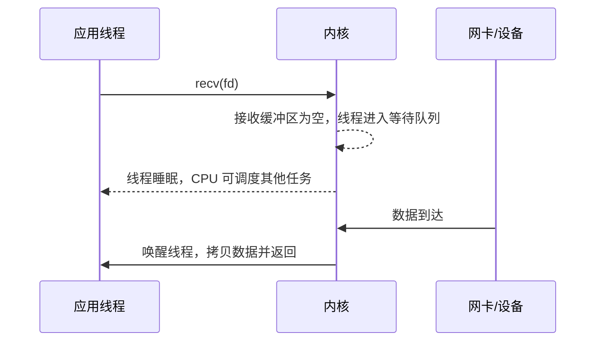

非阻塞式 I/O 则不同。应用通常通过 `fcntl(fd, F_SETFL, O_NONBLOCK)` 将 fd 设为非阻塞；当数据尚未到达时，`read()` / `recv()` 不会让线程睡眠，而是立即返回 `-1`，并设置 `errno` 为 `EAGAIN` 或 `EWOULDBLOCK`。这意味着应用线程可以继续执行后续逻辑，但必须自己决定稍后何时再尝试读取。

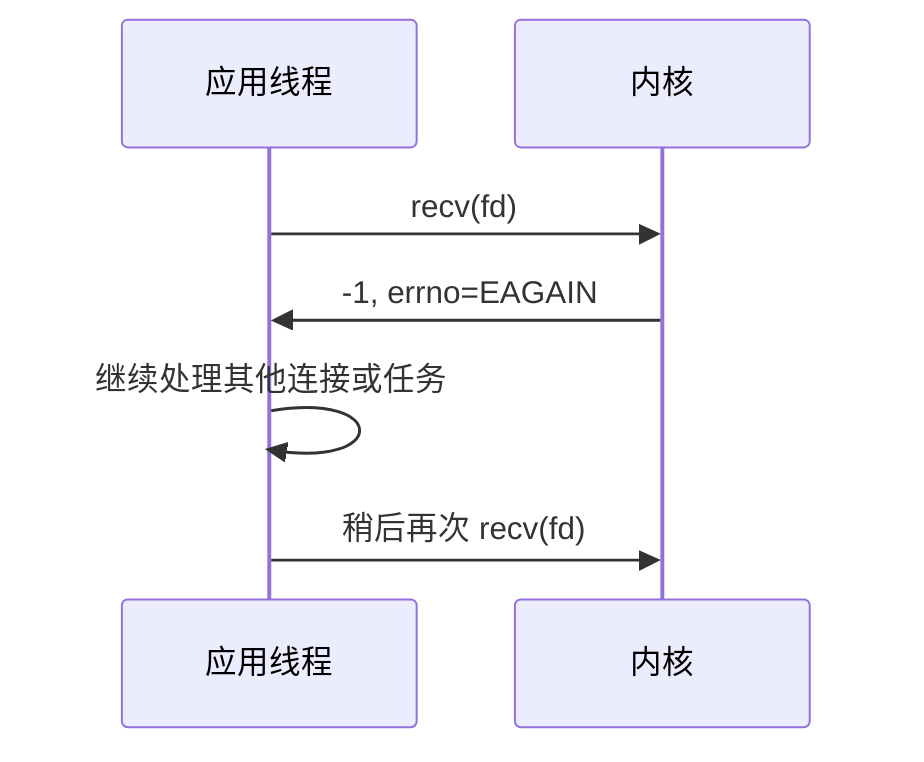

两者的关键差异可以总结如下：

| 维度 | 阻塞式 I/O | 非阻塞式 I/O |
|---|---|---|
| fd 暂时不可读/不可写时 | 当前线程睡眠，直到条件满足或出错 | 系统调用立即返回 `EAGAIN/EWOULDBLOCK` |
| 控制流 | 代码顺序简单，像同步函数调用 | 需要循环、状态机或事件通知配合 |
| CPU 使用 | 睡眠期间不占用 CPU | 若盲目重试会忙等，需要配合 `select/poll/epoll` |
| 并发模型 | 常见为一个连接一个线程/进程 | 常见为少量事件循环线程管理大量连接 |
| 主要风险 | 线程数量、栈内存、上下文切换成本高 | 状态管理复杂，必须正确处理短读、短写和 `EAGAIN` |

因此，阻塞模型的优点是代码简单、状态容易维护；缺点是并发连接数上升后，若采用“一个连接一个线程/进程”，会消耗大量线程栈、调度时间和同步成本。非阻塞模型本身不会自动带来高吞吐，如果应用只是反复调用 `read()` 轮询，也会浪费 CPU；它通常要和 `select()`、`poll()`、`epoll` 这类 I/O 多路复用机制配合：多路复用接口负责告诉应用“哪些 fd 现在可能可读/可写”，应用再对这些 fd 执行非阻塞 `accept()`、`read()` 或 `write()`。

### 3.2 I/O 多路复用：select、poll、epoll

I/O 多路复用的本质是让一个线程同时等待多个文件描述符的”就绪事件”。应用通常把 socket 设为非阻塞，先注册或传入关注的事件，然后在事件返回后执行 `accept()`、`read()` 或 `write()`。

#### 3.2.1 select()

`select()` 使用位图（fd_set）来表示关注的 fd 集合，`readfds`、`writefds` 和 `exceptfds` 分别是读、写和异常事件的位图，glibc 中常见 `FD_SETSIZE` 为 1024。调用前，fd_set 的语义是“应用关注哪些 fd”；调用后，内核会原地改写这些 fd_set，使其语义变为“关注集合中哪些 fd 已经就绪”。由于位图只记录每个 fd 对应的 bit 是否为 1，并不保存一个可直接遍历的 fd 列表，应用要找出哪些 bit 被置位，就必须按 `[0, nfds)` 范围检查各个 fd。因此，每一轮事件循环都要重新填充完整的关注集合，再在 `select()` 返回后范围扫描 fd_set，找出具体哪些 fd 可读、可写或异常。

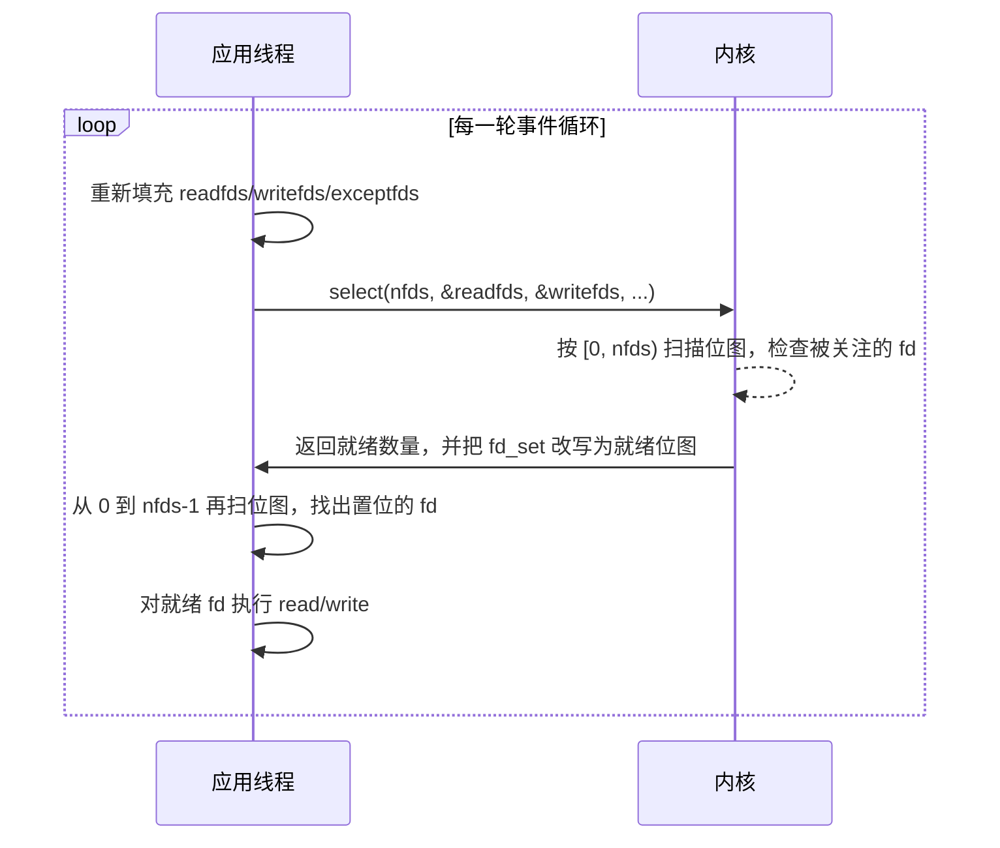

**关键开销**：① 用户态每轮重新填充 `readfds/writefds/exceptfds` 关注位图；② 系统调用把完整位图从用户态复制到内核；③ 内核按 `[0, nfds)` 范围读取位图并检查被关注的 fd；④ 用户态再次按同一范围扫描返回后的位图，才能知道具体哪些 fd 就绪。根本原因是位图提供的是“按 fd 编号查 bit”的表示，不提供“直接枚举所有置位 fd”的列表。监控 fd 范围越大、活跃 fd 越少，无效扫描越严重。

#### 3.2.2 poll()

`poll()` 将 fd 集合改为 `struct pollfd` 数组，消除了 `FD_SETSIZE` 的硬限制，接口也更清晰。每个数组元素包含 fd 编号、关注的事件（events）和返回的就绪事件（revents）。

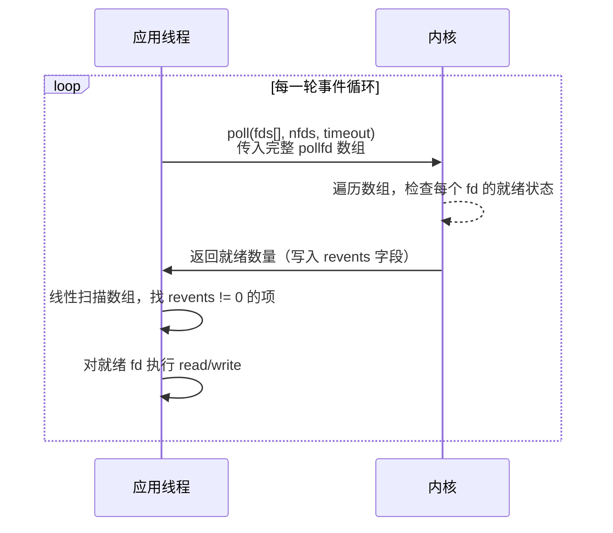

`poll()` 相比 `select()` 的改进：无位图大小限制，fd 编号不连续时没有空洞扫描。但核心问题与 `select()` 相同：**每轮调用都要把完整数组在用户态与内核之间来回传递，并做线性扫描**。连接数为 N、活跃连接数为 k 时，每轮开销是 O(N) 而非 O(k)。

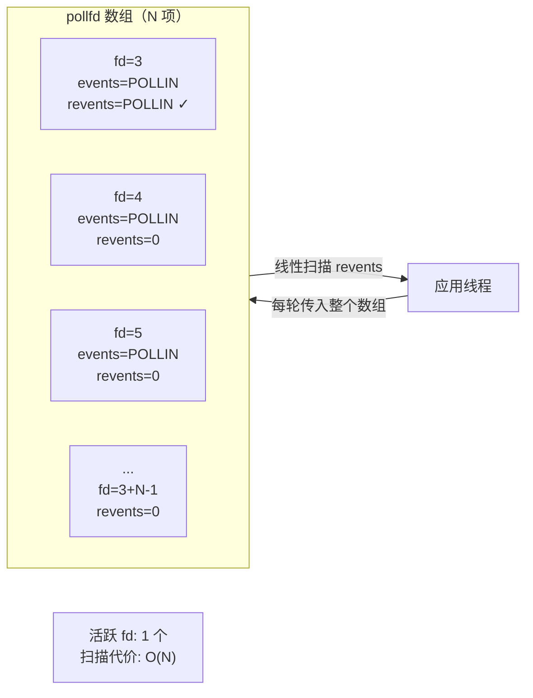

#### 3.2.3 epoll

`epoll` 是 Linux 特有接口，针对 `poll()` 的 O(N) 扫描问题提出了根本性解决。它在内核中维护两个核心数据结构：

- **interest list（关注集合）**：用红黑树存储所有被关注的 fd，支持 O(log N) 的增删改（`epoll_ctl`）。
- **ready list（就绪链表）**：当某个 fd 上发生就绪事件时，内核通过回调把该 fd 加入此链表，`epoll_wait()` 只需返回链表中的项。

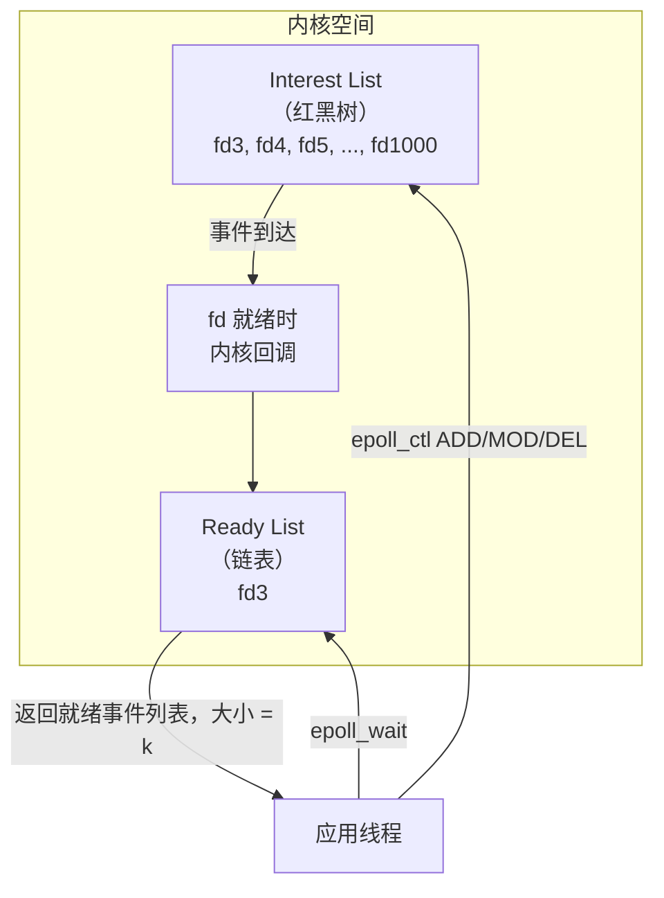

**关键差异**：`epoll_wait()` 的返回开销是 O(k)（k 为当前就绪 fd 数），而不是 O(N)。当 N 很大、k 很小时（典型的长连接场景），epoll 的优势极为明显。

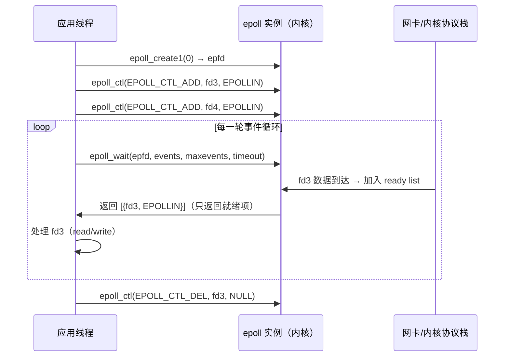

#### 3.2.4 LT 与 ET 触发模式对比

`epoll` 有两种触发方式，决定了就绪事件何时被报告以及应用需要如何响应：

| 模式 | 语义 | 编程要求 | 适用场景 |
|---|---|---|---|
| 水平触发 LT | 只要 fd 仍处于就绪状态，后续 `epoll_wait()` 仍可能返回该事件 | 编程较简单，可以逐步读取 | 默认模式，适合教学和普通服务器 |
| 边缘触发 ET | 只在状态从未就绪变为就绪时通知 | fd 必须非阻塞；收到事件后通常要循环读/写直到 `EAGAIN` | 高性能场景，但更容易出现遗漏事件的 bug |

下图从“数据到达后 fd 可读”这一点出发，区分 LT 与 ET 两种处理路径：

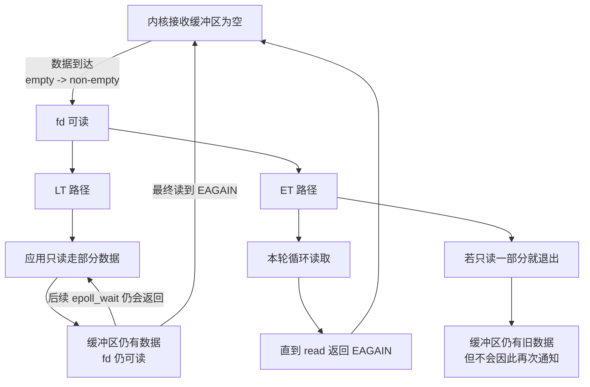

LT 的路径是：如果应用只读走一部分数据，内核接收缓冲区仍然非空，fd 仍处于可读状态，因此后续 `epoll_wait()` 还会继续返回该 fd；应用可以分多轮逐步读，直到最终读到 `EAGAIN`，fd 才暂时回到“不可读/未就绪”。ET 的路径是：通知只发生在 `empty -> non-empty` 这类边缘变化上，因此收到通知后应在本轮事件处理中循环读取，直到 `EAGAIN`。若 ET 模式只读一部分就退出，缓冲区中仍有旧数据，但不会因为“仍然有数据”再次通知，连接可能因此“挂住”。

#### 3.2.5 三种接口的核心差异总结

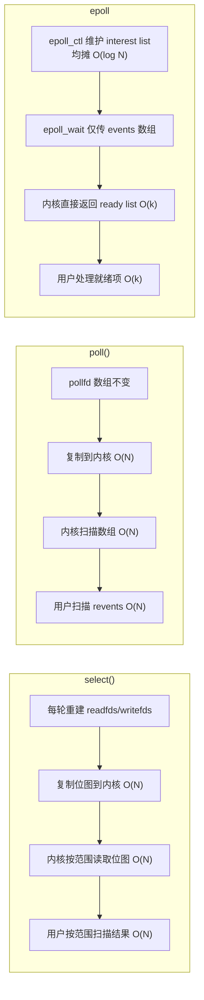

在 Lab1 中，`poll()` 是最低要求，适合作为理解多路复用的基础；`epoll` 是加分项，也更接近真实 Linux 高并发服务器。建议先用 LT 模式实现 `epoll_server`，再视情况探索 ET 模式的性能差异。

### 3.3 异步 I/O：POSIX AIO 与 io_uring

多路复用给应用的是“就绪通知”：内核告诉应用某个 fd 现在可读或可写，真正的读写仍由应用随后发起。异步 I/O 更接近“完成通知”：应用提交一个 I/O 请求，内核或运行时在后台完成操作，然后通知应用结果。

POSIX AIO 提供 `aio_read()`、`aio_write()`、`aio_error()`、`aio_return()` 等接口，可通过信号、线程通知或轮询获得完成状态。它的优点是标准化和可移植；局限是 Linux 上的 POSIX AIO 在很多场景下并不是高性能网络 I/O 的主流选择，语义、实现和适用文件类型也会影响实际效果。

io_uring 是 Linux 5.1 起引入的新接口，其核心是两个环形队列：

提交队列项 SQE 描述要执行的操作，完成队列项 CQE 返回结果。队列可映射到用户态，应用可以批量提交请求、批量收割完成事件，并在某些模式下减少 `io_uring_enter()` 调用。io_uring 的优势是统一、批处理和低系统调用开销；代价是接口复杂、内核版本相关、调试难度较高。对 Lab1 而言，它很适合作为“异步 I/O 加分项”进行原理调研，若实现则建议先实现最小 TCP echo 或文件 I/O microbenchmark。

### 3.4 多线程 I/O

多线程 I/O 常见有两种形式：

1. 一个连接一个线程：实现直观，但连接数上升后线程数量和上下文切换难以控制。
2. 线程池：固定数量 worker 从任务队列取任务，避免无限创建线程。

线程池模型的优势是能利用多核，并且适合处理 CPU 密集任务或可能阻塞的慢任务；缺点是需要队列、锁、条件变量等同步机制，任务粒度过小时锁竞争和调度成本会吞掉收益。在 echo server 这种轻量网络 I/O 场景中，纯线程池未必优于事件驱动；但如果请求处理包含压缩、加密、数据库访问或磁盘 I/O，线程池可作为事件循环的补充。

## 4. 模型横向对比

从演进脉络看，最朴素的阻塞式 I/O 可以理解为“单个执行流围绕单个 fd 等待”：当数据尚未到达时，线程被内核挂起，数据到达、连接关闭或出错后再由内核唤醒。这种方式控制流直观，但如果一个线程要同时服务多个 fd，就可能被其中一个 fd 卡住。非阻塞 I/O 将“等待”从单次 `read()` / `write()` 系统调用中移出：fd 暂时不可读或不可写时立即返回 `EAGAIN/EWOULDBLOCK`，应用线程因此可以继续处理其他连接。从效果上看，它把“是否继续等待、何时重试”的控制权交给应用，使单线程维护多个 fd 成为可能；但如果应用自己反复轮询每个 fd，又会形成忙等和无效扫描。`select()`、`poll()`、`epoll` 正是对这一路径的进一步优化：由内核统一等待一组 fd 的就绪状态，并返回当前哪些 fd 值得尝试 I/O。它们提供的是“就绪通知”，真正的 `read()` / `write()` 仍由应用线程执行；而 POSIX AIO、io_uring 更接近“完成通知”，即应用提交请求后再收割完成结果。在 `epoll` 中，LT 与 ET 则进一步规定“就绪状态如何被通知”：LT 只要条件仍满足就会反复提示，适合简单稳妥的实现；ET 只在状态变化边缘通知，要求应用在一次事件处理中尽量读写到 `EAGAIN`，以换取更少的重复通知和更明确的状态推进。

| 模型 | 并发方式 | 通知类型 | 主要优势 | 主要局限 | Lab1 建议 |
|---|---|---|---|---|---|
| 阻塞 I/O | 多进程/多线程 | 无显式事件通知 | 简单、易调试 | 高并发下线程/进程成本高 | 作为背景，不建议主测 |
| `select()` | 单线程监控多个 fd | 就绪通知 | 可移植 | fd 集合限制和重复扫描 | 可在论文中分析，不必实现 |
| `poll()` | 单线程监控 fd 数组 | 就绪通知 | 无固定 1024 fd 集合限制，接口清晰 | 每轮仍需处理数组，空闲连接多时低效 | 必做实现 |
| `epoll` | 内核维护关注集合 | 就绪通知 | 适合大量连接，避免每轮传入完整集合 | Linux 特有，ET 模式易错 | 推荐加分实现 |
| POSIX AIO | 提交请求后等待完成 | 完成通知 | 标准化、接口完整 | Linux 实践中限制较多 | 重点调研即可 |
| io_uring | SQ/CQ 异步提交完成 | 完成通知 | 批处理、低 syscall 开销、统一接口 | 内核版本依赖和实现复杂度高 | 可作为高阶加分项 |
| 线程池 I/O | 多 worker 并发执行 | 由队列/条件变量协调 | 利用多核，适合慢任务 | 锁竞争、上下文切换、队列积压 | 必做实现 |

## 5. 开源项目架构调研

仅比较 `select`、`poll`、`epoll` 或线程池这些基础接口，还不足以回答“真实服务器如何组织高吞吐 I/O 路径”。成熟开源项目通常会把 I/O 多路复用、进程/线程模型、连接状态机、慢任务隔离、资源限制和可运维性组合起来。下面选取 NGINX、Redis 和 libuv 三个代表项目：NGINX 代表多 worker 事件驱动网络服务器，Redis 代表单主事件循环的数据服务，libuv 代表跨平台事件循环库。

### 5.1 NGINX：多 worker + 非阻塞事件驱动

NGINX 的基本运行模型是一个 master 进程加一个或多个 worker 进程。官方文档说明，master 负责读取和评估配置、维护 worker；worker 执行实际请求处理，worker 数量可以固定，也可以按 CPU 核数自动配置 [8]。NGINX 支持 `select`、`poll`、`epoll`、`kqueue`、`/dev/poll`、`eventport` 等连接处理方法，并会在平台支持多个方法时通常自动选择最高效的方法；在 Linux 2.6+ 上可使用 `epoll` [10]。

NGINX 的关键不是简单“多进程”，而是每个 worker 内部都是非阻塞、事件驱动的状态机。worker 等待监听 socket 和已连接 socket 上的事件：监听 socket 就绪时接受新连接，连接 socket 可读/可写时推进 HTTP、stream 或 mail 协议状态机 [9]。一个 worker 不为单个连接阻塞等待网络数据，而是在一次事件处理后立刻回到事件循环，继续处理其他就绪连接。

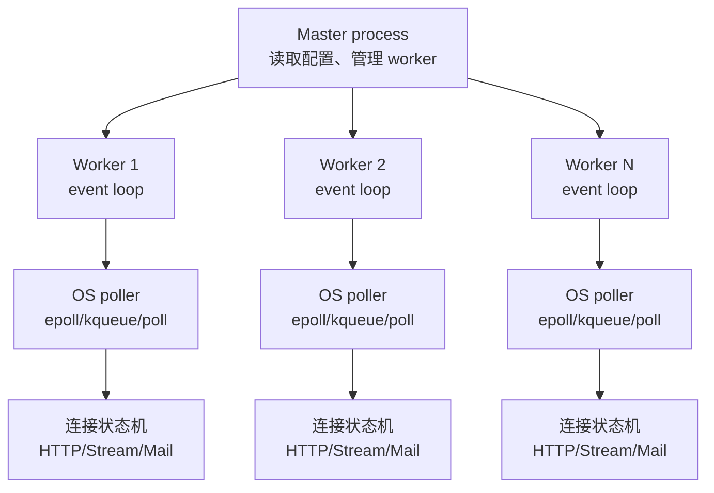

这种结构给 Lab1 的启发有三点。第一，高并发服务器应尽量避免“一个连接一个线程/进程”的资源模型，连接更适合作为事件循环中的轻量状态对象。第二，多 worker 能利用多核，但每个 worker 内部仍保持相对简单的单线程事件循环，减少锁竞争和跨线程共享状态。第三，连接数量上限不仅由 I/O API 决定，还取决于 `worker_connections`、文件描述符限制、每连接内存、输出缓冲和系统调优。

### 5.2 Redis：单主事件循环 + 非阻塞客户端 + 慢任务隔离

Redis 的架构选择与 NGINX 不同。它不是通用 HTTP 代理，而是以内存数据结构为核心的数据服务，因此更重视命令执行路径的确定性和数据结构访问的局部性。Redis 文档说明，新客户端连接被接受后，socket 会被设置为非阻塞，并创建可读文件事件，以便数据一到达就收集查询 [12]。Redis 的事件库 `ae.c` 封装了操作系统 polling facility，并将文件事件和时间事件组织进一个事件循环 [11]。

Redis 的主请求处理模型基本是“单线程事件循环串行执行命令”。官方 latency 文档把 Redis 描述为 mostly single threaded：一个进程用多路复用服务客户端请求，请求按顺序处理；性能来自单个命令通常很短，并且设计上避免在 socket 读写等系统调用上阻塞 [13]。这种模型省去了大量锁、线程同步和共享数据结构一致性问题，非常适合 GET/SET/LPUSH 等短小内存操作。

但 Redis 也暴露了单事件循环的代价：一旦某个命令很慢，其他客户端都会等待。文档明确提醒，`SORT`、集合大操作、生产环境中的 `KEYS` 等慢命令可能造成延迟；RDB/AOF 相关的 fork、fsync、磁盘 I/O 也会影响主循环 [13]。因此 Redis 会把部分慢 I/O 放到后台线程或后台进程，例如较慢的磁盘 I/O、AOF fsync、RDB/AOF rewrite 等，尽量让主事件循环只做短路径工作。

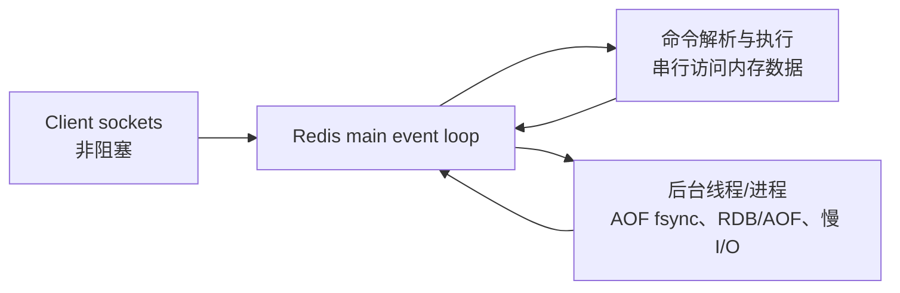

Redis 对 Lab1 的启发是：事件循环并不等于“什么都放在一个线程里”。若请求处理逻辑很短，单线程事件循环可以获得极低的同步成本；若存在慢命令、磁盘刷盘或 CPU 密集任务，就必须隔离到后台执行路径，并用队列、事件通知或状态标志把结果汇回主循环。对 echo server 来说，纯事件循环足够；对真实业务服务器来说，要明确哪些逻辑能留在 Reactor，哪些必须交给 worker。

### 5.3 libuv：跨平台事件循环 + 请求/句柄抽象 + 全局线程池

libuv 不是一个业务服务器，而是 Node.js 等系统背后的跨平台异步 I/O 库。它的价值在于把不同操作系统的事件通知机制抽象成统一事件循环：Linux 上可使用 `epoll`，macOS/BSD 上使用 `kqueue`，Windows 上使用 IOCP [14]。libuv 文档强调 event loop 是中心结构，通常绑定在单个线程；网络 I/O 使用非阻塞 socket 和平台最佳 poller，回调在 loop 线程中触发 [14]。

libuv 同时区分两类对象：handle 表示长生命周期对象，例如 TCP server handle；request 表示一次性操作，例如写请求或文件系统请求。这种设计使连接、定时器、进程、文件系统操作都能进入同一套事件循环语义。loop 每轮会处理定时器、pending callbacks、prepare/idle/check、I/O poll、close callbacks 等阶段，使“网络事件”“定时任务”“异步完成事件”可以在一个可预测的节奏中推进 [14]。

对于无法直接用非阻塞 poller 表达的任务，libuv 使用线程池。文档说明，文件系统操作、`getaddrinfo`/`getnameinfo` 和用户通过 `uv_queue_work()` 提交的工作会进入线程池；工作完成后，after-work 回调会回到 loop 线程执行 [15]。默认线程池大小为 4，可通过 `UV_THREADPOOL_SIZE` 调整，但更大的线程池意味着更高内存占用和调度成本 [15]。

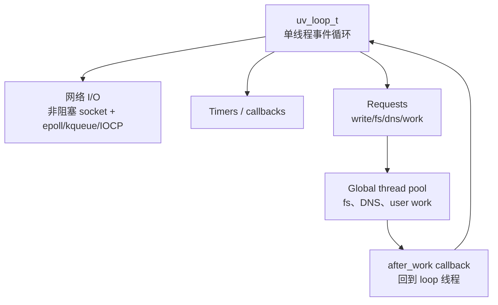

libuv 对 Lab1 的启发是：高吞吐架构可以把“事件循环线程”和“阻塞任务线程池”明确分层。网络连接仍由事件循环管理，避免多线程同时读写同一个 socket；文件 I/O、DNS、压缩、日志刷盘等可能阻塞或耗时的任务交给 worker pool；任务完成后通过事件或回调回到原 loop。这个模型比简单线程池更容易控制连接生命周期，也比纯事件循环更能承受慢任务。

### 5.4 三个项目的共同模式与差异

| 项目 | 核心模型 | 网络 I/O 路径 | 慢任务处理 | 可借鉴点 |
|---|---|---|---|---|
| NGINX | master/worker，多 worker 事件循环 | worker 内非阻塞 socket + OS poller，Linux 上可用 epoll | cache helper、上游连接、文件缓存和系统调优配合 | 多 worker 利用多核；每个 worker 内部保持事件驱动和少共享 |
| Redis | 单主事件循环，命令串行执行 | 客户端 socket 非阻塞；事件库封装 poller | 后台线程/进程处理 AOF、RDB、慢 I/O；避免慢命令阻塞主循环 | 短任务留在主循环；慢任务隔离；重视输出缓冲和延迟监控 |
| libuv | 跨平台单 loop 抽象 + 全局线程池 | 网络 I/O 在 loop 线程内用非阻塞 socket 和平台 poller | fs、DNS、用户任务进入线程池，完成后回调到 loop | 明确区分 handle/request；用 worker pool 补足阻塞操作 |

综合来看，成熟项目很少把“高并发”理解成简单增加线程数。它们共同强调：连接管理要轻量，网络 I/O 要非阻塞，事件循环要尽量短小，慢任务必须被隔离，资源上限和背压要显式设计。差异在于业务场景：NGINX 面向大量网络连接和代理状态机，适合多 worker；Redis 的核心是内存数据结构一致性和低延迟，适合单主循环；libuv 作为基础库，需要跨平台抽象并把阻塞系统调用转成异步完成。

对本实验的高吞吐 echo server 设计而言，可以吸收三者的共同结构：使用 Reactor 持有连接和 socket 状态，使用 `epoll` 或 `poll` 等机制获得就绪事件，用固定大小 worker pool 处理可选的 CPU/阻塞任务，并通过队列或 eventfd 将完成结果交回 Reactor 写回客户端。

## 6. 实验设计方案

### 6.1 实验目标

实验目标不是追求绝对性能，而是解释不同模型在并发连接数、请求速率、延迟分布和资源消耗上的差异。建议实现 TCP echo server：客户端发送固定大小消息，服务器原样返回，客户端记录往返时间。

### 6.2 待测服务器版本

| 版本 | 实现要点 | 预期观察 |
|---|---|---|
| `poll_server` | 监听 socket + `pollfd` 数组；接受连接后加入数组；可读时循环 `read/write` | 连接数上升时，扫描数组开销增加，空闲连接越多越明显 |
| `thread_pool_server` | acceptor 接收连接，将连接或请求分发到固定 worker | 低并发下简单稳定；高并发下可能受锁和线程调度影响 |
| `epoll_server`（可选） | `epoll_create1` + `epoll_ctl` + `epoll_wait`，建议先用 LT 模式 | 大量连接下比 `poll` 更稳定，尤其在活跃连接占比低时 |
| `io_uring_server`（可选） | 使用 liburing 或原生接口提交 accept/read/write | syscall 批处理可能更优，但编码复杂度最高 |

### 6.3 客户端与测试参数

建议自己编写压测客户端，而不是直接用 `wrk` 或 `ab`，因为 echo 协议不是 HTTP。客户端可提供如下参数：

| 参数 | 含义 | 示例 |
|---|---|---|
| `-c` | 并发连接数 | 100、500、1000、5000 |
| `-n` | 总请求数 | 100000 |
| `-s` | 单次消息大小 | 64B、1KB、16KB |
| `-t` | 客户端线程数 | 1、2、4、8 |
| `-d` | 持续压测时间 | 30s 或 60s |

记录指标：

- 吞吐量：requests/s、MB/s。
- 延迟：平均值、P50、P95、P99。
- 连接容量：最大稳定并发连接数。
- 资源占用：CPU 使用率、RSS 内存、上下文切换次数。
- 错误率：连接失败、超时、短读短写、`EAGAIN` 处理错误。

### 6.4 实验控制变量

为了让数据可信，建议固定以下条件：

- 同一台机器、同一内核、同一编译参数。
- server 和 client 可以先在同机 loopback 测试，再在两机网络测试。
- 每组参数至少运行 3 次，报告平均值和波动范围。
- 避免在后台运行下载、编译、虚拟机迁移等干扰任务。
- 调整 `ulimit -n`，否则高并发连接会先撞到 fd 限制。
- 对非阻塞 I/O 正确处理 `EAGAIN/EWOULDBLOCK`、短读、短写和连接关闭。

### 6.5 预期结果与解释框架

1. 低并发、短消息时，各模型差距可能不大，瓶颈主要是系统调用和协议处理。
2. 并发连接增加但活跃连接占比低时，`poll()` 的数组扫描成本更容易暴露，`epoll` 通常更有优势。
3. 线程池模型在连接数较大时会受到线程数量、任务队列和锁竞争影响；若 worker 数量设置过大，吞吐量可能下降。
4. 如果请求处理包含 CPU 计算，线程池或“事件循环 + worker 池”会比单线程事件循环更能利用多核。
5. io_uring 的收益依赖内核版本、提交批量、操作类型和实现质量；在小规模教学实验中，复杂度可能比收益更明显。

论文中不要直接把上述预期写成实测结论。完成实验后，应将实测数据填入表格，并解释与预期一致或不一致的原因。

## 7. 高吞吐量 I/O 服务器架构设计

### 7.1 推荐架构

结合第 5 章的开源项目调研，推荐架构是“多 Reactor + epoll + 工作线程池”的混合模型：

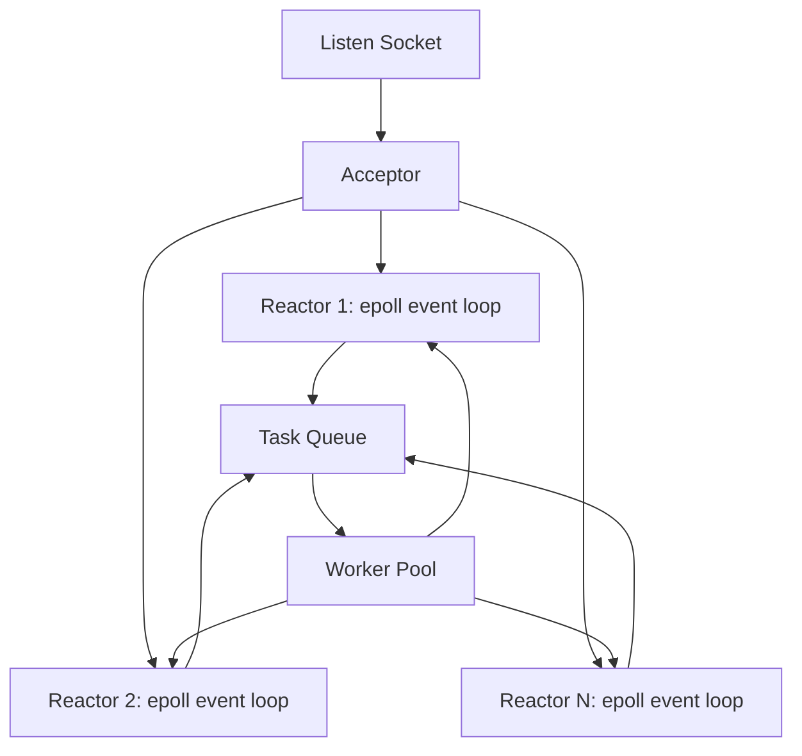

设计原则如下：

- 网络连接由 Reactor 线程持有，避免多个线程同时操作同一个 fd。
- 每个 Reactor 使用非阻塞 socket 和 `epoll_wait()` 处理 accept/read/write。
- CPU 密集、磁盘访问、数据库访问等慢任务投递到 worker pool。
- worker 处理完成后通过 eventfd、pipe 或无锁/低锁队列通知对应 Reactor 写回响应。
- 每个连接维护输入缓冲、输出缓冲和状态机，避免在一次事件中无限占用 Reactor。
- 对输出缓冲设置上限，客户端读取慢时启用背压，防止内存无限增长。

### 7.2 为什么不是纯线程池

纯线程池的实现成本低，但高并发长连接下会遇到几个问题：连接到线程的分配策略复杂；多个线程可能争抢共享任务队列；每个请求都跨线程传递会增加缓存失效；大量阻塞 socket 会放大上下文切换。对于 echo server 这种轻量 I/O，事件循环通常更适合。

### 7.3 为什么不是纯单线程事件循环

纯单线程事件循环能避免锁竞争，Redis 早期设计证明了该路线在内存型、短命令场景中的有效性。但一旦业务逻辑出现慢任务，单线程事件循环会被阻塞，所有连接延迟都会抖动。因此，更通用的高吞吐架构应保留 worker pool，将慢任务移出主 I/O 路径。

### 7.4 与开源项目的对应关系

- 对应 NGINX：多 Reactor 类似多 worker，把连接分散到多个事件循环以利用多核。
- 对应 Redis：每个 Reactor 内部尽量串行处理自己持有的连接，避免多个线程同时操作同一 fd。
- 对应 libuv：worker pool 只处理 CPU/阻塞任务，完成后把结果交还给事件循环写回。

这些实践共同说明：高性能服务器通常不是简单地“多开线程”，而是把连接管理、事件通知、任务执行和资源隔离分层。

## 8. 论文写作建议

Part B 论文可以按如下结构展开：

1. 摘要：说明研究对象、实现模型、测试指标和主要发现。
2. 引言：从 C10K 问题引出高并发 I/O 的挑战。
3. 相关工作：介绍 APUE/UNP、Linux man-pages、io_uring、C10K 问题。
4. 开源项目架构调研：分析 NGINX、Redis、libuv 的 I/O 架构和工程取舍。
5. 原理分析：对阻塞 I/O、`poll`、`epoll`、POSIX AIO/io_uring、线程池逐一分析。
6. 实验设计：说明 echo 协议、服务器版本、客户端、参数和指标。
7. 实验结果：用表格和折线图展示吞吐量、延迟和资源占用。
8. 架构设计：提出自己的高吞吐服务器方案，并解释设计取舍。
9. 结论：总结哪种模型适合哪类场景，并说明实验局限。

写作时应避免只罗列数据。较好的分析方式是围绕“现象 -> 原因 -> 证据 -> 局限”组织。例如：当 `poll` 在 5000 空闲连接下吞吐下降，应解释数组扫描和用户态遍历成本；当线程池 P99 延迟升高，应检查队列等待、worker 数量和上下文切换。

## 9. 结论

本次调研表明，高吞吐量 I/O 服务器的关键不在于单个 API 的速度，而在于能否减少无效等待、降低重复扫描、控制线程调度成本，并在慢任务出现时保护主 I/O 路径。`poll()` 适合教学和中小规模连接；`epoll` 更适合 Linux 上的大量连接；线程池适合 CPU 或阻塞任务，但不宜盲目扩大线程数；io_uring 代表 Linux 异步 I/O 的新方向，适合在掌握事件驱动模型后进一步探索。NGINX、Redis 和 libuv 的共同经验也说明，优秀的服务器架构通常会把连接管理留在事件循环中，把慢任务隔离到后台路径，并通过明确的缓冲、队列和背压机制控制资源。

对 Lab1 Part B，建议先完成 `poll_server` 与 `thread_pool_server`，保证数据完整可信；再实现 `epoll_server` 作为加分对照；若时间充足，再以 io_uring 做小规模原型或深入调研。最终论文应将实测结果与本报告中的原理分析结合，形成可验证的结论。

## 参考文献

[1] Michael Kerrisk. select(2) - Linux manual page. Linux man-pages. https://man7.org/linux/man-pages/man2/select.2.html

[2] Michael Kerrisk. poll(2) - Linux manual page. Linux man-pages. https://man7.org/linux/man-pages/man2/poll.2.html

[3] Michael Kerrisk. epoll(7) - Linux manual page. Linux man-pages. https://man7.org/linux/man-pages/man7/epoll.7.html

[4] IEEE/The Open Group. aio_read(3p) - POSIX Programmer's Manual. https://www.man7.org/linux/man-pages/man3/aio_read.3p.html

[5] Michael Kerrisk. aio(7) - Linux manual page. https://man7.org/linux/man-pages/man7/aio.7.html

[6] Jens Axboe. Efficient IO with io_uring. 2019. https://kernel.dk/io_uring.pdf

[7] Dan Kegel. The C10K problem. https://kegel.com/c10k.html

[8] NGINX Documentation. Control NGINX Processes at Runtime. https://docs.nginx.com/nginx/admin-guide/basic-functionality/runtime-control/

[9] NGINX Community Blog. Inside NGINX: How We Designed for Performance & Scale. https://blog.nginx.org/blog/inside-nginx-how-we-designed-for-performance-scale

[10] NGINX Documentation. Connection processing methods. https://nginx.org/en/docs/events.html

[11] Redis Documentation. Event library. https://redis.io/docs/latest/operate/oss_and_stack/reference/internals/internals-rediseventlib/

[12] Redis Documentation. Redis client handling. https://redis.io/docs/latest/develop/reference/clients/

[13] Redis Documentation. Diagnosing latency issues. https://redis.io/docs/latest/operate/oss_and_stack/management/optimization/latency/

[14] libuv Documentation. Design overview. https://docs.libuv.org/en/v1.x/design.html

[15] libuv Documentation. Thread pool work scheduling. https://docs.libuv.org/en/v1.x/threadpool.html

[16] W. Richard Stevens, Stephen A. Rago. Advanced Programming in the UNIX Environment. Addison-Wesley.

[17] W. Richard Stevens, Bill Fenner, Andrew M. Rudoff. UNIX Network Programming, Volume 1: The Sockets Networking API. Addison-Wesley.
